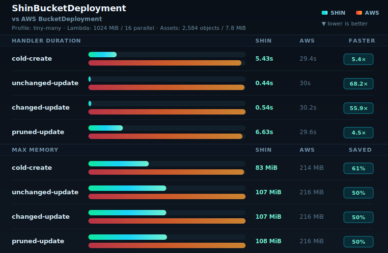
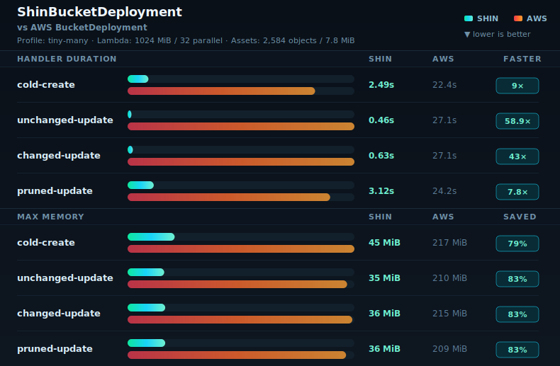
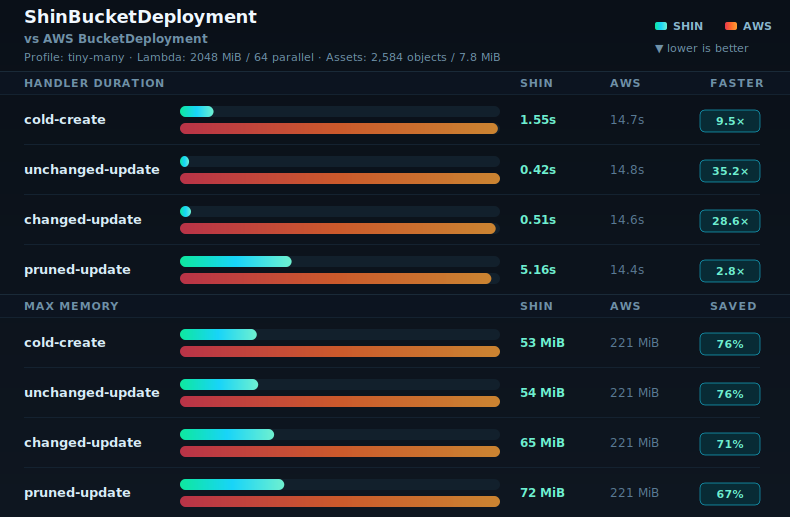
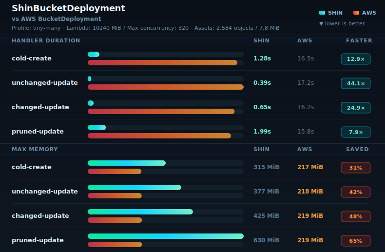

# Benchmarks

This folder contains committed benchmark support assets, sanitized current result rows, and report/render tooling. Raw benchmark evidence stays outside the repo.

Deployable benchmark CDK apps live in `benchmarks/apps/**`. Curated benchmark matrices live in `benchmarks/configs/**`, shared JSON Schemas live in `benchmarks/schemas/**`, and benchmark configs are run through `pnpm benchmark:run-assets -- --config <path>`.

Every Shin benchmark enables `detailedFailureDiagnostics`; upstream AWS CDK samples record the setting as not applicable. Benchmark measurements therefore exercise the conservative, fully observable Shin mode, including detailed failed-attempt bookkeeping. Normal production deployments default this option to disabled and retain only the basic aggregate retry, wire, and failure counters.

An intentional methodology-v1 overhead control may pass `--detailed-failure-diagnostics false`. The runner records this as part of benchmark configuration identity, omits the Lambda diagnostics environment variable, verifies the deployed runtime state, and records `detailedFailureDiagnostics: false`. Methodology v2 rejects this override and remains diagnostics-on.

`configs/methodology-v2-1024-32.json` is the canonical approval-gated matrix: five sequential repetitions of `tiny-many` and `large-few` at 1024 MiB / 32 Shin transfers against one deduplicated upstream baseline per profile. Start with one repetition, report elapsed time and preliminary results, then resume repetitions 2–5 only after the maintainer approves an explicit wall-clock cap. Before a new methodology-v2 run, the runner builds the measured provider from the clean evidence-source commit in a detached worktree, equivalent to `node scripts/build-bootstrap.mjs --benchmark arm64`. The generated local provenance binds the ignored archive to that commit, its complete source-tree identity, clean build state, build environment, and Cargo, Rust, cargo-lambda, and Zig versions. The runner records a unique run/sample identity, exact source and deployed-provider identity, phase-local memory scope, and cleanup state. Upstream rows use `parallel: null` because that setting does not apply to AWS CDK `BucketDeployment`.

Methodology-v1 diagnostics may intentionally measure a stable uncommitted worktree before a review commit exists. For a new run, the runner uses `node scripts/build-bootstrap.mjs --benchmark-current-tree arm64`; this rebuilds the application and provider from that exact tree and binds the archive to its dirty-state flag, complete source-tree digest, application-build digest, and toolchain. Source drift remains forbidden after the run starts. Dirty methodology-v1 diagnostics are investigative evidence and do not satisfy the clean, comparable methodology-v2 performance-acceptance requirement.

Methodology-v2 run IDs are opaque UUIDs. The scratch directory contains a resume manifest binding that UUID to the source commit and bootstrap, package/CDK identities, normalized benchmark configuration, phases, destination, exact five-repetition sample matrix, and evidence-ledger digest. A resume rejects identity drift or an evidence ledger change not recorded by the runner. Methodology-v2 report, telemetry, and snapshot publication also requires `--scratch-root <external-run-directory>` and rejects a ledger that no longer matches that manifest. The wall-clock limit is checked before every stack and between phases; an in-flight external command cannot be stopped at an exact timestamp, but after it returns the runner enters cleanup instead of starting another phase. `SIGINT` and `SIGTERM` terminate the active command process group and then attempt the same stack cleanup.

`--preserve-on-failure true` is an opt-in execution control and does not change benchmark configuration identity. Before deployment the runner arms a scratch-only `preserved-stack.json` intent manifest. A caught deployment failure marks it `preserved-after-failure` and leaves the tagged stack and provider log group intact for inspection; retained resources can incur AWS cost. A subsequent resume fails closed while that stack exists. Remove the stack manually, then rerun: after verified absence the runner removes the manifest and may continue. When preservation is enabled, a preexisting owned stack is never deleted automatically, even if no manifest is present, because it may contain failure evidence. A successful run still destroys and verifies the stack before removing the intent manifest. Abrupt process termination can leave the intent state armed; the same fail-closed resume check applies.

`configs/transfer-scheduler-2048-32.json` is the serialized 2048 MiB / 32-transfer decision matrix for the bounded scheduler: `tiny-many` and `large-few`, Shin and upstream, and the four ordered lifecycle phases. Repeat it with unique scratch roots and output files when collecting a multi-sample decision run; raw per-repetition evidence remains outside git.

`configs/marker-replacement-2048-32.json` is the comparable marker-path matrix. Its `marker-heavy` profile deploys one 16 MiB marker-bearing object plus four small ordinary files through Shin and upstream across create, unchanged, and changed phases. The fixture pads against fixed resolved parameter defaults so synthesized token placeholder lengths cannot change the deployed payload. Marker decision results and interpretation live in [`docs/benchmark.md`](../docs/benchmark.md#marker-replacement-performance-decision).

`configs/large-few-source-window-diagnostic-1024-32.json` is a one-repetition, Shin-only failure diagnostic. It runs `large-few` cold-create sequentially at 1024 MiB and `maxParallelTransfers=32`, first with the adaptive local source window and then with an explicit 128 MiB window (`sourceWindowBytes: 134217728`). `sourceWindowBytes` is a first-class configuration, sample-identity, deployed-environment, result-metadata, aggregation, and report dimension; `null` means adaptive. Run this comparison with `--preserve-on-failure true` only after local gates pass and the maintainer reconfirms the cost-incurring region/profile inputs. Stop after any preserved failure and inspect/capture it before manual cleanup or another sample. Do not interpret this diagnostic as performance acceptance without comparable before/after Shin and upstream evidence.

The runner adds a benchmark-only invocation token to the deployment custom resource for every phase. This guarantees that `unchanged-update` measures an actual provider invocation even when the deterministic asset and all functional deployment properties are unchanged; the token does not change the asset, destination, or provider algorithm.

Repeated historical decision runs belong in `results.jsonl` too. Their `decisionRunId`, `comparisonVariant`, and `repetition` fields preserve every sample instead of replacing an earlier repetition. Methodology-v2 runs use the general `runId`, `sampleId`, and `repetition` identity instead.

Rows without `methodologyVersion` are methodology v1 historical evidence. Default report and telemetry rendering selects only completed methodology-v2 rows. Pass `--methodology-version 1` to the comparison report only when intentionally inspecting historical results. Before any v2 report, telemetry table, or README snapshot is rendered, every required field and the exact matrix from the canonical config are validated; missing, duplicate, dirty, incomplete, or unplanned cells fail rendering. Methodology-v2 tables report `n`, median, Q1, Q3, and IQR.

Before expanding an AWS benchmark to multiple repetitions, run one smoke repetition per variant, report its elapsed time and preliminary signal, and obtain maintainer approval for the proposed repetition count and wall-clock budget. Every completed run writes its sanitized rows directly to `results.jsonl`; do not defer persistence until the whole matrix finishes.

Resume the printed smoke UUID with `--run-id <uuid> --start-repetition 2 --repetitions 4` and the same config, snapshot date, scratch location, destination, and approved cap. Asking for repetitions outside 1–5 is rejected.

README benchmark snapshots use sanitized tiny-many records from `benchmarks/results.jsonl`. Snapshot filenames follow `<profile>-<memory>mib-<parallel>.svg`, for example `tiny-many-1024mib-32.svg`.

Only README-linked snapshot SVGs are committed under `benchmarks/snapshots`. Temporary alternate layouts can be regenerated locally with `benchmarks/src/render/readme-snapshot.ts`, but should not be kept as committed design history. Generated report charts live beside the report output by default.

## Shin Provider Telemetry

- In-depth Shin provider telemetry: [`telemetry.md`](telemetry.md)
- Structured JSONL source: [`results.jsonl`](results.jsonl)

Regenerate the currently committed historical telemetry tables with `pnpm benchmark:telemetry-table -- --methodology-version 1`. Omit the selector after methodology-v2 evidence is committed. Current provider diagnostics use strict schema v4; the collector continues to validate historical schema-v3 records without changing or invalidating committed rows. Schema v4 retains the existing deployment/callback, scheduler, source, deletion, replay, and marker fields and adds bounded sanitized `PutObject` SDK/service classifications plus correlated body/source failure groups. The exact failure fields and interpretation are documented in [`docs/architecture.md`](../docs/architecture.md#diagnostics). Historical rows render unavailable fields as `null`.

For failed deploys, the runner waits until the phase's Lambda `REPORT` event is visible and then writes three independent CloudWatch captures under the external scratch sample directory: an unfiltered phase-scoped raw event export, `shin_put_object_attempt_failure` events, and `shin_deployment_summary` events when present. The immediate failure event is emitted before provider retry/backoff or transfer cleanup and does not depend on the final summary. Abruptly terminated invocations may have no summary; that absence must not discard an immediate attempt event. Raw CloudWatch exports, resource descriptions, log metadata, preservation manifests, and any identifiers remain outside git. A preserved stack/log group also permits later recapture when log ingestion is delayed.

## 1024 MiB / 16 Snapshot

Four-phase snapshot using the latest tiny-many 1024 MiB Shin `maxParallelTransfers=16` rows.

## 1024 MiB / 32 Snapshot

Four-phase snapshot using the latest tiny-many 1024 MiB Shin `maxParallelTransfers=32` rows.

## 2048 MiB / 64 Snapshot

Four-phase snapshot using the latest tiny-many 2048 MiB Shin `maxParallelTransfers=64` rows.

## 10240 MiB / 320 Snapshot

Four-phase snapshot using the latest tiny-many 10240 MiB Shin `maxParallelTransfers=320` rows.

