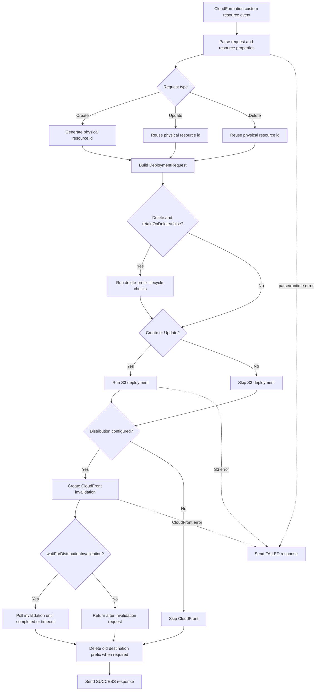
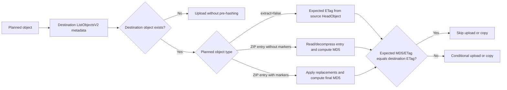

# Architecture

This document is the source of truth for the current `RustBucketDeployment` provider architecture. It replaces the older split notes for checksum strategy, Lambda workflow, engine transition, `s3-unspool` comparison, and examples.

## Runtime Shape

`RustBucketDeployment` is a Rust-backed CDK custom resource for S3 static asset deployment. It keeps the familiar `BucketDeployment`-style construct API while replacing the upstream AWS CLI sync path with direct AWS SDK operations.

The provider Lambda:

- plans objects directly from source archives or source objects
- reads extracted ZIP sources with ranged S3 `GetObject` requests
- does not download the full ZIP to memory
- does not write the source ZIP or extracted entries to Lambda `/tmp`
- lists the destination prefix once with `ListObjectsV2`
- skips unchanged objects when destination metadata is sufficient
- uploads changed extracted objects with conditional `PutObject`
- copies `extract=false` sources with `CopyObject`
- deletes destination keys not present in the plan when `prune=true`
- creates optional CloudFront invalidations after S3 changes

Current fixed runtime constants:

| Setting | Value | Purpose |
| --- | ---: | --- |
| `MAX_PARALLEL_TRANSFERS` | 8 | Bounds copy, hash, upload, and delete-adjacent work. |
| `SOURCE_BLOCK_BYTES` | 8 MiB | Source range block size for ZIP entry reads. |
| `SOURCE_BLOCK_MERGE_GAP_BYTES` | 256 KiB | Maximum gap for coalescing adjacent source spans. |

## Supported Examples

Examples are driven through the repository runner:

```bash
pnpm example list
pnpm example synth simple
pnpm example deploy cloudfront-sync
pnpm example destroy retain-on-delete
```

| Example | File | Purpose |
| --- | --- | --- |
| `simple` | `examples/simple-app.ts` | Plain deployment under a destination prefix. |
| `replacement` | `examples/replacement-behavior-app.ts` | Deploy-time marker replacement across asset, data, JSON, and YAML sources. |
| `cloudfront-sync` | `examples/cloudfront-invalidation-sync-app.ts` | CloudFront invalidation with stack wait. |
| `cloudfront-async` | `examples/cloudfront-invalidation-async-app.ts` | CloudFront invalidation without stack wait. |
| `metadata-filters` | `examples/metadata-filters-app.ts` | Include/exclude filters and S3 metadata mapping. |
| `prune-update-v1` / `prune-update-v2` | `examples/prune-update-v1-app.ts`, `examples/prune-update-v2-app.ts` | Update path that removes destination objects absent from the new source plan. |
| `retain-on-delete-v1` / `retain-on-delete-v2` | `examples/retain-on-delete-v1-app.ts`, `examples/retain-on-delete-v2-app.ts` | Update/delete behavior when `retainOnDelete=true`. |
| `benchmark-assets` | `examples/benchmark-assets-app.ts` | Deterministic benchmark asset bundles. |

## Handler Flow



## S3 Deployment Flow

For `extract=true`:

1. `HeadObject` the source ZIP.
2. Read ZIP central directory metadata with ranged `GetObject`.
3. Walk central-directory entries.
4. Apply include and exclude filters.
5. Build a manifest of planned ZIP entries with normalized destination keys, source archive index, entry offsets, compressed size, and uncompressed size.
6. Coalesce planned source spans into shared source blocks.
7. List the destination prefix once.
8. For missing marker-free destination objects, stream the source entry directly into `PutObject`.
9. For existing marker-free destination objects, read/decompress the entry through ranged source blocks, compute MD5, and compare it with the destination `ETag` from the list response.
10. Materialize marker entries in memory, apply replacements, compute MD5 over final bytes, and upload when changed.

For `extract=false`:

1. `HeadObject` each source object.
2. Build copy plans using the source object `ETag` as the expected content identity.
3. List the destination prefix once.
4. Skip copies whose destination `ETag` matches.
5. Run changed copies with `CopyObject` and `MetadataDirective=REPLACE`.

Destination listing is also used for pruning. With `prune=true`, objects under the destination prefix that are not in the current deployment plan are removed with `DeleteObjects` in 1000-key chunks.

## Skip Decisions



The provider intentionally uses destination `ETag` as the only unchanged-object skip identity. `ListObjectsV2` exposes the destination `ETag`, but it does not expose the actual checksum value needed to compare S3 `ChecksumCRC32`. Using CRC32 for skip decisions would require one checksum-mode `HeadObject` per destination object, which is not worth the request volume for this deployment model.

Without an embedded source MD5 catalog, marker-free ZIP entries that already exist at the destination must be read and decompressed to compute MD5 on every deployment. Missing marker-free objects skip this pre-hash and stream straight to upload. Entries with deploy-time markers are fully materialized in memory, replacements are applied, and MD5 is computed over the final replaced bytes.

`extract=false` copies use source and destination `ETag` comparison for skipping. Source object `ETag` comes from a source `HeadObject`; destination `ETag` comes from the single destination list.

## Write Safety

Extracted uploads use conditional writes:

- missing destination objects use `If-None-Match: *`
- changed existing objects use `If-Match` with the `ETag` observed during destination listing

This avoids silently overwriting destination objects that changed after the provider listed the prefix. A conditional-write conflict fails the deployment rather than hiding concurrent mutation.

`extract=false` remains on the `CopyObject` path. Its skip decision uses `ETag`, but the copy itself is not the same conditional extracted upload path.

## Engine Transition

The older extract path downloaded each source ZIP from S3, wrote the full archive to Lambda `/tmp`, opened it with `ZipArchive`, and reread the temporary file for planning, fallback hashing, and upload streaming.

The current path reads the ZIP central directory and entry bodies through S3 ranges. This removes the full-archive ephemeral-storage dependency and makes source ZIP size independent of Lambda `/tmp`. Replacement-expanded entries still must fit in memory because their final bytes are only known after marker substitution.

The current implementation intentionally adopted these `s3-unspool` ideas:

- avoid local archive staging
- avoid full archive loading
- treat the ZIP object as a random-access S3 source
- read central-directory metadata through ranges
- reopen entry streams from ranges so upload bodies are retryable
- use separate S3 clients for source reads and destination writes
- coalesce adjacent source spans into shared source blocks
- keep destination listing as the central comparison input
- use conditional writes for extracted uploads

The main `s3-unspool` behavior not implemented yet is an embedded `.s3-unspool/catalog.v1.json` MD5 catalog. That catalog lets unchanged files be skipped from destination `ETag` metadata without reading and hashing ZIP entry bodies during deployment.

The catalog cannot be created cheaply inside the provider Lambda after CDK has already produced a normal ZIP. It has to be produced during asset packaging, while original file bytes are being streamed into the ZIP. Deploy-time marker replacement also means catalog entries are only straightforward for marker-free files, because marker replacement changes the uploaded bytes after packaging.

## Compatibility Tradeoffs

| CDK behavior | Engine impact |
| --- | --- |
| Deploy-time marker replacement | Marker entries are materialized after ranged extraction so final replaced bytes can be hashed and uploaded. |
| Multiple sources with override order | The provider builds one manifest across sources before pruning and upload decisions. |
| Include/exclude filters | Filters are applied while walking ZIP entries. |
| S3 metadata and content type handling | Upload and copy requests apply CDK metadata options. |
| `extract=false` | Copy mode stays separate from ZIP extraction. |
| `prune` and `retainOnDelete` | Destination listing and delete planning remain provider-owned. |
| CloudFront invalidation | Runs after S3 deployment and is outside the extraction engine. |
| CDK asset packaging | Existing source binding is preserved, which delays catalog-based sparse-update optimization. |

## Limits

- Skip decisions assume simple single-part static objects where S3 `ETag` is the MD5 of object bytes.
- Without a source MD5 catalog, unchanged existing ZIP entries must be read and hashed during deployment.
- Metadata-only changes may be skipped when content identity is unchanged.
- Multipart objects, SSE-KMS/SSE-C objects, and objects written by other tools may not expose usable content identity.
- Large marker-replaced entries must fit in Lambda memory.
- The provider is a static asset deployment engine, not a general-purpose sync engine with byte-range diffs or persistent manifests.

## Next Architecture Targets

The highest-value architecture work is now:

1. Add structured provider telemetry for every planning, skip, read, write, prune, and invalidation step.
2. Build a benchmark runner that captures local wall time, CloudFormation timing, provider logs, S3 request counts, bytes read/written, and destination object state.
3. Add optional cataloged asset packaging for marker-free sources to unlock metadata-only sparse-update skips.
4. Make concurrency and block-store settings configurable for benchmark experiments before deciding whether they should be user-facing.
