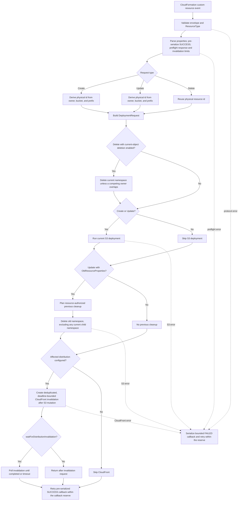
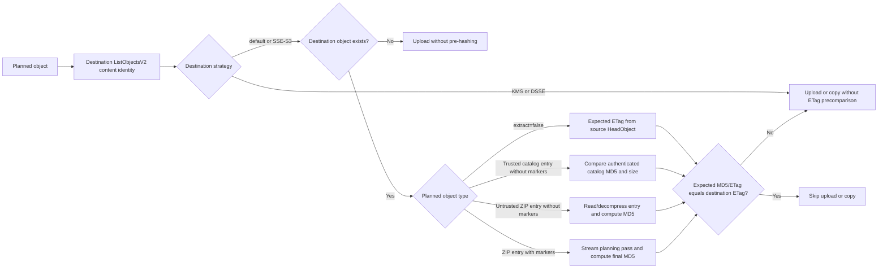

# Architecture

This document is the source of truth for the current `ShinBucketDeployment` provider architecture.

## Runtime Shape

`ShinBucketDeployment` is a Rust-backed CDK custom resource for S3 static asset deployment. It keeps the familiar `BucketDeployment`-style construct API while replacing the upstream AWS CLI sync path with direct AWS SDK operations.

The provider Lambda:

- plans objects directly from source archives or source objects
- reads extracted ZIP sources with ranged S3 `GetObject` requests
- does not download the full ZIP to memory
- does not write the source ZIP or extracted entries to Lambda `/tmp`
- lists the destination prefix once for comparison metadata and, when that list finds a stale candidate, again page by page after transfers
- skips unchanged objects when destination content identity is sufficient
- uploads changed extracted objects with `PutObject`
- copies `extract=false` sources with `CopyObject`
- deletes destination keys not present in the plan when `destinationLifecycle.onDeploy.deleteStaleObjects` is enabled
- creates optional CloudFront invalidations after S3 changes

Runtime tuning defaults:

| Setting | Default | Purpose |
| --- | ---: | --- |
| `maxParallelTransfers` | 32 | Bounds the continuously drained set of copy, hash, upload, and related logical object tasks; valid range 1–256. |
| `memoryLimit` | 1024 MiB | Sizes the Lambda. The provider reads the actual value from the Lambda runtime environment. |

Most deployments should tune only `memoryLimit` and, when needed, `maxParallelTransfers`. Source block/window and destination-write retry settings remain available under `advancedRuntimeTuning` as support and benchmark escape hatches. The `putObjectRetry` property name predates provider-owned `CopyObject` retries and remains stable for compatibility:

| Advanced setting | Default | Purpose |
| --- | ---: | --- |
| `advancedRuntimeTuning.sourceBlockBytes` | 8 MiB | Source range block size for ZIP entry reads. Valid range 30 bytes through JavaScript's maximum safe integer; it must fit the global budget. |
| `advancedRuntimeTuning.sourceBlockMergeGapBytes` | 256 KiB | Maximum gap for coalescing adjacent source spans. Valid range 0 through JavaScript's maximum safe integer. |
| `advancedRuntimeTuning.sourceGetConcurrency` | derived from actual Lambda memory, 1 to 8 | Maximum concurrent source ranged `GetObject` block fetches per archive; explicit valid range 1–64. Block size times concurrency must fit the global budget. |
| `advancedRuntimeTuning.sourceWindowBytes` | derived from the global budget and ZIP file count | Per-archive source block window. It must be at least one block and no greater than the invocation-global budget. |
| `advancedRuntimeTuning.sourceWindowMemoryBudgetMb` | 50% of actual Lambda memory | Optional lower invocation-global source block budget. It cannot raise the 50% cap. |
| `advancedRuntimeTuning.putObjectRetry.maxAttempts` | 6 | Maximum provider-owned `PutObject` or `CopyObject` attempts; valid range 1–10. |
| `advancedRuntimeTuning.putObjectRetry.baseDelayMs` / `maxDelayMs` | 250 / 5000 | Non-throttling destination-write retry delays; each is 0–60000 ms and base cannot exceed max. |
| `advancedRuntimeTuning.putObjectRetry.slowdownBaseDelayMs` / `slowdownMaxDelayMs` | 1000 / 30000 | Throttling destination-write retry delays; each is 0–60000 ms and base cannot exceed max. |
| `advancedRuntimeTuning.putObjectRetry.jitter` | `full` | Jitter mode for computed destination-write retry delays; `none` is also supported. |

Numeric tuning values must be safe integers. Synthesis validates resolved values and their cross-field memory relationships; unresolved CloudFormation tokens are validated by the Rust provider with checked conversions and arithmetic. Invalid zeroes, extremes, inverted delays, and budget overcommit fail explicitly rather than being clamped or replaced by defaults.

Source ranged reads use a fixed three-total-attempt provider policy. Each attempt disables SDK retries. Transport failures, timeouts, throttling, retryable 5xx responses, body read failures, and incomplete bodies may consume the remaining attempts; permanent 4xx, construction failures, and local validation errors do not.

Fixed ZIP entry streaming defaults keep per-transfer memory bounded:

| Internal setting | Default | Purpose |
| --- | ---: | --- |
| ZIP entry read buffer | 64 KiB | Pulls decompressed entry bytes for size/CRC validation, strategy-selected MD5 or SHA-256, marker input, and upload production. |
| ZIP entry S3 body chunk | 256 KiB | Size of each `Bytes` frame offered to the destination `PutObject` body. |
| ZIP entry body pipe capacity | 1 MiB | Backpressure between entry production and the SDK upload body consumer. |

The default provider Lambda memory is 1024 MiB. The runtime reads `AWS_LAMBDA_FUNCTION_MEMORY_SIZE`; the custom-resource payload is not trusted as the memory source. Half of the actual memory becomes the default invocation-global ZIP planning and source-block cap, leaving the other half for runtime, SDK, transfer, marker, and manifest allocations. The 1024 MiB default was selected from historical exploratory measurements whose single-sample methodology is now being revalidated; those rows are not a performance guarantee or a sufficient basis for changing production defaults.

| Budget item at default settings | Approximate budget |
| --- | ---: |
| Invocation-global ZIP planning and source block cap | 512 MiB |
| Adaptive local-window runtime/base reserve | 64 MiB |
| Adaptive local-window transfer reserve, `32 * 12 MiB` | 384 MiB |
| Adaptive local-window in-flight GET reserve, `4 * 8 MiB` | 32 MiB |
| Adaptive local-window ZIP metadata reserve | 2 KiB per file |
| Derived per-archive source window for a large ZIP | About 32 MiB minus the file reserve, still governed by the 512 MiB global cap |

The explicit streaming buffers are small enough to fit inside the transfer worker reserve: each active marker-free upload stream uses about 64 KiB read buffer, 64 KiB held-back validation buffer, 256 KiB body assembly buffer, and up to 1 MiB of queued body frames. Marker uploads add a bounded replacement pipe, one held-back output frame, and at most `longest marker token - 1` bytes of input carry; they do not retain the complete entry or replacement output. At 32 active marker-free transfers, entry stream buffering is roughly 44 MiB. Each archive derives a local window from the shared budget and its file count, but local windows do not reserve independent memory. The local window bounds speculative scheduler prefetch and ordinary demand reads. When a body replay reactivates a released or failed earlier block, that specific demand fetch may borrow unused invocation-global permits instead of stalling behind later prefetched blocks that fill the local window. Pending fetches acquire fair 4 KiB-granularity permits from one invocation-wide semaphore; fetching and ready blocks retain those permits until all claims release them, so the invocation-global cap remains the hard aggregate bound. Failure and deadline cancellation drop permits and wake global and local waiters. For small archives, the source window is clamped down to the actual source ZIP size, so observed RSS is much lower than the worst-case budget.

Adaptive source window formula:

```text
actualMemoryMiB = AWS_LAMBDA_FUNCTION_MEMORY_SIZE
globalSourceBudgetBytes = floor(actualMemoryBytes / 2)
globalSourceBudgetBytes = min(globalSourceBudgetBytes, explicitLowerBudgetBytes)

sourceGetConcurrency = clamp(actualMemoryMiB / 256, 1, 8)

reservedBytes =
  64 MiB
  + (maxParallelTransfers * 12 MiB)
  + (zipFileCount * 2 KiB)
  + (sourceGetConcurrency * sourceBlockBytes)

capacityBytes = min(globalSourceBudgetBytes - reservedBytes, sourceZipBytes)

if capacityBytes > 512 MiB:
  capacityBytes -= 384 MiB

sourceWindowBytes = min(capacityBytes, 512 MiB)
sourceWindowBytes = max(sourceWindowBytes, min(sourceBlockBytes, sourceZipBytes))

sum(resident source block bytes across archives) <= globalSourceBudgetBytes
```

`advancedRuntimeTuning.sourceWindowMemoryBudgetMb` can lower `globalSourceBudgetBytes`; it cannot raise the half-memory cap. The final local-window `max` ensures at least one validated source block can be admitted, while the `min(sourceZipBytes)` clamp avoids planning a larger local window than the archive can contain. The global semaphore, not the sum of local-window values, is the aggregate bound.

## Supported Scenarios

Scenarios are driven through the repository runner. Verification mode runs every default correctness scenario when no name is provided; benchmark mode runs the selected benchmark scenario across the requested config matrix.

```bash
pnpm verify list
pnpm verify synth
pnpm verify deploy --concurrency 4
pnpm verify deploy cloudfront-sync
pnpm benchmark deploy assets --asset-profiles tiny-many --implementations shin,aws --lambda-max-parallel-transfers 32 --lambda-memory-mb 1024
```

Verification deploy/destroy can run independent scenario chains concurrently with `--concurrency`; ordered update chains still run in sequence within each chain.

| Scenario | File | Purpose |
| --- | --- | --- |
| `simple` | `scenarios/apps/basic/simple-app.ts` | Plain deployment under a destination prefix. |
| `root-prefix` | `scenarios/apps/basic/root-prefix-app.ts` | Deployment without `destinationKeyPrefix`, writing at bucket root. |
| `marker-replacement` | `scenarios/apps/content/marker-replacement-app.ts` | Deploy-time marker replacement across asset, data, JSON, and YAML sources. |
| `filters` | `scenarios/apps/content/filters-app.ts` | Include/exclude filter behavior. |
| `source-overwrite-order` | `scenarios/apps/content/source-overwrite-order-app.ts` | Duplicate source keys where later sources win. |
| `external-zips` | `scenarios/apps/content/external-zips-app.ts` | External Info-ZIP and Python forced-ZIP64 archives deployed through `Source.bucket`. |
| `co-tenant-protection-initial` / `co-tenant-protection-updated` | `scenarios/apps/lifecycle/co-tenant-protection-initial-app.ts`, `scenarios/apps/lifecycle/co-tenant-protection-updated-app.ts` | Ordered root-prefix update proving that default stale cleanup retains a child namespace owned by another deployment. |
| `child-parent-retention-initial` / `child-parent-retention-updated` | `scenarios/apps/lifecycle/child-parent-retention-initial-app.ts`, `scenarios/apps/lifecycle/child-parent-retention-updated-app.ts` | Ordered child-to-parent move proving that omitted `onChange.deleteObjects` retains the previous child namespace even though current stale deletion defaults on. |
| `child-parent-cleanup-initial` / `child-parent-cleanup-updated` | `scenarios/apps/lifecycle/child-parent-cleanup-initial-app.ts`, `scenarios/apps/lifecycle/child-parent-cleanup-updated-app.ts` | Ordered child-to-parent move proving that explicit `onChange.deleteObjects` removes obsolete child objects while preserving keys in the current manifest, independently of current stale deletion. |
| `cross-bucket-change-initial` / `cross-bucket-change-updated` | `scenarios/apps/lifecycle/cross-bucket-change-initial-app.ts`, `scenarios/apps/lifecycle/cross-bucket-change-updated-app.ts` | Ordered bucket and prefix change proving that `onChange.fromBucket` authorizes deletion from the old bucket while current stale deletion remains disabled. |
| `handler-isolation` | `scenarios/apps/security/handler-isolation-app.ts` | Two default-sharing deployments and two isolated deployments proving three distinct handler/role boundaries and four independently writable namespaces. |
| `stale-object-cleanup-initial` / `stale-object-cleanup-updated` | `scenarios/apps/updates/stale-object-cleanup-initial-app.ts`, `scenarios/apps/updates/stale-object-cleanup-updated-app.ts` | Ordered update chain that removes destination objects absent from the updated source plan. |
| `stale-object-retention-initial` / `stale-object-retention-updated` | `scenarios/apps/updates/stale-object-retention-initial-app.ts`, `scenarios/apps/updates/stale-object-retention-updated-app.ts` | Ordered update chain with stale-object deletion disabled, preserving destination objects absent from the updated source plan. |
| `default-retention-initial` / `default-retention-updated` | `scenarios/apps/retention/default-retention-initial-app.ts`, `scenarios/apps/retention/default-retention-updated-app.ts` | Ordered update chain proving that the default retains previous destination objects and current objects on Delete. |
| `object-deletion-initial` / `object-deletion-updated` / `object-deletion-bucket-only` | `scenarios/apps/retention/object-deletion-initial-app.ts`, `scenarios/apps/retention/object-deletion-updated-app.ts`, `scenarios/apps/retention/object-deletion-bucket-only-app.ts` | Ordered update chain proving explicit previous-destination object deletion on Update, followed by current-destination object deletion on Delete. |
| `replacement-safety-initial` / `replacement-safety-updated` | `scenarios/apps/retention/replacement-safety-initial-app.ts`, `scenarios/apps/retention/replacement-safety-updated-app.ts` | Ordered handler-memory replacement with destructive Delete cleanup enabled, proving the live destination survives replacement cleanup. |
| `extract-false` | `scenarios/apps/basic/extract-false-app.ts` | Direct archive copy mode with `extract=false`, provider-owned retry settings, destination guards, and opaque lost-response reconciliation metadata. |
| `large-archive` | `scenarios/apps/scale/large-archive-app.ts` | Larger archive ranged-read path. |
| `kms-destination` | `scenarios/apps/security/kms-destination-app.ts` | KMS-encrypted destination bucket. |
| `kms-managed-destination` | `scenarios/apps/security/kms-managed-destination-app.ts` | AWS-managed S3 KMS destination for the stored-checksum path. |
| `dsse-managed-destination` | `scenarios/apps/security/dsse-managed-destination-app.ts` | Managed DSSE destination for the stored-checksum path. |
| `cloudfront-sync` | `scenarios/apps/cloudfront/cloudfront-sync-app.ts` | CloudFront invalidation with explicit paths and synchronous stack wait. |
| `cloudfront-async` | `scenarios/apps/cloudfront/cloudfront-async-app.ts` | CloudFront invalidation with default paths and asynchronous stack completion. |
| `assets` | `benchmarks/apps/assets-app.ts` | Deterministic benchmark asset bundles. |

## Handler Flow



By default, compatible deployments create a stack-scoped handler whose construct ID hashes its Lambda settings and source identity. Prebuilt source identity includes the package version, architecture, and exact bootstrap archive SHA-256. Local compilation includes the package version and manifest path, while normalized bundling settings remain part of the complete handler identity. Distinct installed package/provider copies therefore cannot silently bind different request shapes to whichever shared handler was created first. Package or provider identity changes replace the shared handler by design; the release introducing this identity performs that handoff once for each legacy shared handler.

`shareHandler:false` instead creates a stable handler child beneath that deployment construct. Construct-generated roles and log destinations are consequently deployment-scoped, and the provider policy receives only that deployment's source, destination, lifecycle, KMS, and CloudFront grants. Explicit `role` or `logGroup` values remain caller-owned and may intentionally be reused. Isolation trades more functions, roles, log resources, and independent cold starts for smaller permission and mutation blast radii; operational cost follows their separate invocations, logs, and any caller-configured provisioned concurrency.

The construct uses the modeled `AWS::CloudFormation::CustomResource` type and includes the handler identity in the custom resource's logical identity. A changed shared Lambda service token therefore creates a replacement instead of attempting the unsupported in-place token update. Isolated handler settings update the stable deployment-scoped function in place. Each custom-resource generation receives a distinct destination-owner identity, while retries of the same generation return the same deterministic physical resource ID. During replacement, the destination bucket's ownership tag is updated before the old generation is deleted; the old handler sees the replacement as an overlapping owner and retains the live namespace. A genuine bucket or prefix change still receives a distinct physical ID and follows the configured cleanup semantics. The package-aware identity transition is therefore safe even when `onDelete.deleteObjects` is enabled. The provider accepts the former custom-named resource type on Delete during migration.

## Changing a destination safely

`destinationLifecycle` groups cleanup by lifecycle phase while each nested property names the action directly:

- `onDeploy` applies whenever current sources are deployed on Create or Update. `deleteStaleObjects` defaults to `true`.
- `onChange` applies only when the destination bucket, prefix, or distribution changed in a CloudFormation Update. Old-object deletion and old-distribution invalidation are both disabled by default.
- `onDelete` applies when CloudFormation deletes the custom resource. `deleteObjects` defaults to `false`.

When only the prefix changes, set `deleteObjects` to `true`. The current bucket remains the authorized bucket, and CloudFormation supplies the old prefix through `OldResourceProperties`:

```ts
new ShinBucketDeployment(this, "DeployWebsite", {
  sources: [Source.asset("site")],
  destinationBucket: websiteBucket,
  destinationKeyPrefix: "site-v2",
  distribution,
  destinationLifecycle: {
    onChange: {
      deleteObjects: true,
    },
  },
});
```

When the bucket changes, pass the previous `IBucket` directly. When the distribution changes, authorize its separate invalidation action explicitly:

```ts
new ShinBucketDeployment(this, "DeployWebsite", {
  sources: [Source.asset("site")],
  destinationBucket: newBucket,
  destinationKeyPrefix: "site-v2",
  distribution: newDistribution,
  destinationLifecycle: {
    onChange: {
      deleteObjects: true,
      fromBucket: oldBucket,
      invalidateDistribution: oldDistribution,
    },
  },
});
```

| Changed value | `destinationLifecycle.onChange` |
| --- | --- |
| Prefix only | `{ deleteObjects: true }` |
| Bucket | `{ deleteObjects: true, fromBucket: oldBucket }` |
| Distribution | `{ invalidateDistribution: oldDistribution }` |
| Bucket and distribution | `{ deleteObjects: true, fromBucket: oldBucket, invalidateDistribution: oldDistribution }` |

The actions are independent. Omitting `invalidateDistribution` does not block explicitly requested object deletion. If the previous distribution differs and its cached content changed, the provider skips that invalidation and logs that it was not explicitly authorized.

To retain stale objects during normal deployments and delete current objects when CloudFormation deletes the custom resource:

```ts
destinationLifecycle: {
  onDeploy: {
    deleteStaleObjects: false,
  },
  onDelete: {
    deleteObjects: true,
  },
}
```

None of these actions deletes the bucket or CloudFront distribution resource. `deleteStaleObjects` removes only objects in the current namespace that are absent from the deployment plan and match the active include/exclude filters. Before that deletion pass, the provider reads the bucket's Shin ownership tags. An overlapping owner from another deployment retains the stale objects rather than risking co-tenant deletion; this can conservatively retain unrelated stale keys in the same pass. Prefixes must be concrete and at most 102 characters so the complete ownership-tag key is validated before synthesis. `"/"` and an omitted prefix use the same canonical root owner, matching the provider's runtime normalization.

For old-object deletion, omitting `fromBucket` reuses `destinationBucket`; an explicit `fromBucket` authorizes a changed old bucket. An unchanged current distribution is invalidated automatically. A changed old distribution must be passed to `invalidateDistribution` so CDK can grant distribution-specific invalidation permissions and synthesize its dependency.

The provider deploys the current content before considering previous cleanup. It derives the old prefix from `OldResourceProperties`, verifies that the old bucket matches the resource authorized by the new template, and applies the owner and namespace-overlap checks. A missing or mismatched bucket authorization retains the previous destination and logs the reason; it does not undo the successful deployment of current content.

Parent/child prefix changes are segment-aware, and slash runs are exact key bytes rather than aliases. If the previous prefix contains the current prefix, authorized cleanup excludes the complete current namespace. If the current prefix contains the previous prefix, the normal stale pass first protects the complete previous child namespace. Omitting `onChange.deleteObjects` therefore retains that child. When deletion is explicitly authorized, a separate manifest-aware pass removes obsolete keys from the old child after successful transfers while preserving every old-child key still present in the current manifest. Neighboring prefixes such as `site` and `site2` are treated as disjoint.

### Synthesis and permission boundary

`OldResourceProperties` exists only in the runtime Update event. CDK cannot use it during synthesis to add IAM permissions or construct dependencies. This creates different handling for prefixes and resources:

- The provider can derive the old prefix at runtime.
- CDK can reuse the current bucket and distribution permissions when those resources did not change.
- A changed bucket or distribution needs an explicit old-resource reference in the new template.

Because the old prefix is unknown during synthesis, enabling previous object deletion grants List/Delete and ownership-tag access across the selected bucket. The provider limits its operation to the old prefix from `OldResourceProperties`, but the execution role's S3 permission is broader for the duration that the option remains in the template. Remove `destinationLifecycle.onChange.deleteObjects` and `fromBucket` after the transition to remove that additional grant.

Fully automatic cross-bucket cleanup would require wildcard permissions over buckets that are absent from the synthesized construct graph. That would weaken least privilege, omit useful CloudFormation dependencies, and give the provider authority unrelated to the declared migration. Shin instead requires an explicit old `IBucket` for cross-bucket moves and scopes the additional grant to that bucket. Changed CloudFront distributions likewise require an explicit `IDistribution` and receive distribution-specific invalidation permissions.

There is intentionally no lifecycle protocol version, deprecated alias, or compatibility parser in this contract. PR #8 was merged with zero active users, so the clearer API directly replaces it; version negotiation would not protect an existing deployment.

## Upstream `BucketDeployment` lifecycle comparison

This comparison was checked against AWS CDK `main` commit [`2b1c632dc2ab754882bdae066555879d8c702944`](https://github.com/aws/aws-cdk/tree/2b1c632dc2ab754882bdae066555879d8c702944). It is intentionally balanced: upstream's delete-old-first order avoids the specific former Shin regression where deploy-then-sweep could erase newly written child content. Shin keeps new content available and makes the cleanup decision more precise.

Upstream's Python handler:

- Reads `OldResourceProperties`, recursively removes a changed old destination, then calls `s3_deploy` and finally invalidates CloudFront ([handler lines 128–145](https://github.com/aws/aws-cdk/blob/2b1c632dc2ab754882bdae066555879d8c702944/packages/%40aws-cdk/custom-resource-handlers/lib/aws-s3-deployment/bucket-deployment-handler/index.py#L128-L145)).
- Runs the ownership check only for Delete; changed-destination Update cleanup goes directly to `aws s3 rm --recursive`.
- Implements ownership as a raw tag-key `startswith` test ([handler lines 317–332](https://github.com/aws/aws-cdk/blob/2b1c632dc2ab754882bdae066555879d8c702944/packages/%40aws-cdk/custom-resource-handlers/lib/aws-s3-deployment/bucket-deployment-handler/index.py#L317-L332)), so the namespace `site` also matches an owner tag for `site2`.
- Invalidates whenever the current resource properties contain a distribution, including retained or no-op Delete events.

Upstream's TypeScript construct grants the provider against the current destination bucket and uses a wildcard CloudFront resource ([construct lines 415–431](https://github.com/aws/aws-cdk/blob/2b1c632dc2ab754882bdae066555879d8c702944/packages/aws-cdk-lib/aws-s3-deployment/lib/bucket-deployment.ts#L415-L431)). It documents and creates the same `aws-cdk:cr-owned:{prefix}:{hash}` tag family ([construct lines 494–543](https://github.com/aws/aws-cdk/blob/2b1c632dc2ab754882bdae066555879d8c702944/packages/aws-cdk-lib/aws-s3-deployment/lib/bucket-deployment.ts#L494-L543)), but it does not carry an old-bucket construct reference into the new template. Consequently, a cross-bucket update can reach old cleanup without the old bucket's permissions.

Shin differs in these ways:

1. Deploy current content first; never create the upstream delete-before-sync availability gap.
2. Group explicit cleanup actions under deployment, destination-change, and Delete phases. Previous-object deletion is a temporary opt-in; the provider derives the old prefix from `OldResourceProperties` and validates the authorized bucket.
3. Reuse current resources when they are unchanged, while carrying an explicitly changed previous bucket or distribution as a CDK interface so the new template expresses its dependency and functional permissions.
4. Classify same, disjoint, previous-parent, and current-parent namespaces with delimiter-aware comparisons. Previous-parent cleanup excludes the entire current child namespace; current-parent updates need no destructive second sweep.
5. Parse the owner suffix and check symmetric namespace overlap on Update and Delete. A competing owner retains content, while `site` and `site2` remain independent.
6. Treat confirmed `NoSuchBucket` and `NoSuchDistribution` as idempotent success only for cleanup/Delete paths; access-denied and transport errors still fail.
7. Invalidate after S3 mutation, skip retained/no-op Deletes, and merge stable, deduplicated paths when old and current destinations share a distribution.

These lifecycle improvements are in addition to the existing Rust/SDK data path: archive-aware ranged reads, bounded source windows, direct SDK transfer operations, conditional destination writes, and deterministic same-event CloudFront caller references.

## S3 Deployment Flow

For `extract=true`:

1. Accept the synthesis-selected destination checksum strategy: `sse-s3-etag` for default/AES256 buckets or `kms-sha256` for KMS/DSSE buckets.
2. `HeadObject` the source ZIP.
3. Locate and validate classic or ZIP64 end records with ranged `GetObject`, reject impossible entry counts, estimate parser and decoded metadata memory, and reserve it from the invocation-global source budget before parser allocation. The parser reuses the prefetched source blocks.
4. Read and validate the bound central directory. Local entry spans end at the next local header or the directory start rather than using central-header extra-field lengths.
5. Walk central-directory entries and apply include and exclude filters.
6. Evaluate the index-aligned `SourceCatalogs` binding. Unbound sources ignore embedded catalog contents; bound sources must authenticate exactly one `.shin/catalog.v1.json` entry against the template digest.
7. Before applying deployment filters, strictly validate an authenticated catalog and require a one-to-one path and size mapping with every non-directory, non-catalog ZIP entry.
8. Build a manifest of planned ZIP entries with normalized destination keys, source archive index, entry offsets, compressed size, uncompressed size, CRC32, and optional trusted size/MD5 metadata.
9. Preflight every final UTF-8 destination key, single-request object size, archive span, and aggregate output total before destination mutation.
10. Coalesce planned source spans into shared source blocks, locate intersecting blocks with indexed interval boundaries, prefetch them with bounded source GET concurrency, and release blocks after all active readers consume their claims. All archives borrow fairly from the invocation-global source budget. Every provider-owned ranged-read attempt disables SDK retries; transient transport, timeout, throttling, retryable 5xx, and incomplete-body failures can use the remaining three-total-attempt budget, while permanent 4xx and validation failures stop immediately.
11. List the destination prefix for comparison. Count all listed objects, but retain size and `ETag` metadata only for keys in the manifest.
12. On SSE-S3 destinations, skip existing marker-free trusted entries when destination size and `ETag` match the authenticated catalog. Existing untrusted entries are read/decompressed once for CRC/size/MD5 comparison; missing entries avoid that precomparison pass.
13. On KMS/DSSE destinations, do not use destination `ETag` as plaintext MD5 and do not perform a useless precomparison read. Trusted entries still validate their catalog MD5 while streaming; untrusted entries do not compute MD5.
14. Stream every marker-bearing entry through a deterministic planning pass. Simultaneous replacements use leftmost-longest matching, lexicographic token order for equal-length ties, and never rescan replacement bytes. The pass validates source size/CRC/catalog MD5, enforces the expanded size limit, determines exact `Content-Length`, and calculates final MD5 only for SSE-S3 destinations.
15. Skip an unchanged SSE-S3 marker object after that planning pass. Otherwise reopen the entry for a retryable streaming upload pass; each consumed retry body repeats only that bounded upload pass. Hold back the final output frame until source validation and the planning-pass length/digest checks succeed.
16. Set inferred `Content-Type` on every PUT. SSE-S3 uploads retain streamed MD5 for ambiguous-write reconciliation without storing another checksum. KMS/DSSE uploads request stored full-object SHA-256 and calculate the independent expected digest while streaming.
17. Admit at most `maxParallelTransfers` logical object tasks, continuously drain completed joins, and stop admission on the first observed error or panic. Abort and drain outstanding work before stale deletion or invalidation can run.
18. When stale deletion is enabled and the comparison list found a stale candidate, list the destination again after successful transfers and delete non-manifest keys from each page before requesting the next page.

For `extract=false`:

1. `HeadObject` each source object.
2. Build copy plans using the source object `ETag` as the expected content identity.
3. Preflight final keys and known source sizes.
4. List the destination prefix for comparison, retaining metadata only for manifest keys.
5. On SSE-S3 destinations, skip copies whose destination `ETag` matches the source identity. On KMS/DSSE destinations, copy because encrypted destination `ETag`s do not provide that comparison.
6. Run copies with source and destination preconditions, `MetadataDirective=REPLACE`, inferred `Content-Type`, and an opaque reconciliation identity in user metadata. Every provider attempt disables SDK retries. No unused copy checksum is requested.
7. When stale deletion is enabled and the comparison list found a stale candidate, perform the same post-transfer page-streamed destination scan and deletion.

The comparison scan retains at most one destination metadata record per manifest key and one scalar indicating whether it saw an included non-manifest key. With `destinationLifecycle.onDeploy.deleteStaleObjects` enabled, that candidate flag gates a second scan after transfers; destinations without stale candidates avoid the scan. When needed, cleanup holds at most one S3 page of keys and removes included objects absent from the deployment plan with `DeleteObjects` in 1000-key chunks. Destination planning memory is therefore O(manifest keys + one page + transfer concurrency), independent of unrelated destination object count.

## Skip Decisions



The provider's skip identity is content only. It does not expose deployment-wide object metadata overrides and does not parse `OldResourceProperties` for object settings. Every PUT and COPY infers `Content-Type` from the deployed object's file extension with an `application/octet-stream` fallback; cache behavior belongs in CloudFront, while encryption, storage, and lifecycle defaults belong on the bucket.

`ListObjectsV2` exposes destination `ETag`, but not the actual checksum value needed to compare stored SHA-256. Performing one checksum-mode `HeadObject` per destination object would defeat the bounded comparison model. Shin therefore uses catalog/MD5 skips only for default/SSE-S3 destinations and reserves checksum-mode `HeadObject` for reconciling ambiguous KMS/DSSE writes. The optional second list runs only when the comparison list found a stale candidate; it is a page-streamed cleanup pass and retains no comparison metadata.

Directory `Source.asset` inputs are packaged with an authenticated source MD5 catalog. On SSE-S3 destinations, marker-free entries with trusted MD5s and matching destination size can be skipped without reading ZIP entry bytes. Without a trusted catalog match, existing marker-free entries are read and decompressed to compute MD5; missing entries stream straight to upload. On KMS/DSSE destinations, entries stream without a destination-comparison pass because encrypted `ETag`s are not plaintext MD5. ZIP entry reads always validate declared uncompressed size and CRC32, and validate authenticated MD5 whenever present, before the final upload chunk is released.

Marker entries use a compiled multi-pattern automaton with simultaneous, non-recursive semantics. The earliest input match wins; at that position the longest token wins; equal-length tokens are ordered lexicographically. Replacement values, including JSON-escaped values, are written directly and are never searched again. Input carry is bounded by the longest token, so matches may cross any decompression chunk without whole-entry buffering.

S3 requires exact `Content-Length` before `PutObject` starts. Marker entries therefore use one bounded planning pass. If an existing SSE-S3 object has the resulting MD5, deployment stops there. An object that needs upload uses a second bounded pass whose body can be reopened for application or SDK replay. KMS/DSSE marker entries necessarily use both passes because destination `ETag` is not a plaintext identity. The corrected stable-payload decision run in [benchmark](./benchmark.md#marker-replacement-performance-decision) accepted this conditional extra read: current provider time improved 81.9% to 90.9% and peak memory fell 42.4% to 46.5% versus whole-entry materialization while remaining 8.4x to 16.9x faster than upstream.

`extract=false` copies use source and destination `ETag` comparison only on SSE-S3 destinations. Source object `ETag` and exact content length come from a source `HeadObject`; destination `ETag` comes from the single destination list. Missing source identity fails before mutation. KMS/DSSE destinations copy without treating their destination `ETag` as plaintext identity.

## Authenticated Catalog Trust

Cataloged local directories contain compact UTF-8 JSON at `.shin/catalog.v1.json`:

```json
{"version":1,"entries":[{"path":"index.html","size":123,"md5":"..."}]}
```

The serializer fixes field order, orders normalized paths by UTF-8 bytes, and hashes the exact catalog file bytes with SHA-256 while writing them. Each entry contains an exact safe-integer byte size and a 32-character lowercase MD5. `.shin/catalog.v1.json` and `.shin/catalog.v2.json` are reserved input paths; the latter is reserved only to prevent metadata ambiguity and is not a supported second schema.

The construct associates the catalog digest with the returned `SourceConfig` through a module-private `WeakMap`. The custom-resource protocol renders that metadata as an optional `SourceCatalogs` array aligned with `SourceBucketNames` and `SourceObjectKeys`:

```json
[{"Version":1,"Sha256":"<64 lowercase hexadecimal characters>"},{}]
```

An empty object means untrusted. The complete property is omitted when every source is untrusted or `extract=false`. Trusted catalog metadata participates in source deduplication. Because the association is private and there is no public trust option, a third-party `ISource` cannot add a lookalike `SourceConfig` property to opt itself into sparse skipping.

The provider treats a missing `SourceCatalogs` property as an all-untrusted legacy request. If the property is present, its length must exactly match the source arrays. Partial descriptors, unknown fields, unsupported versions, and non-lowercase or incorrectly sized digests fail request validation.

For an untrusted source, the provider never fetches or parses embedded catalog contents. Reserved catalog entries are excluded from destination deployment, and existing destination objects use the actual-byte decompression, size, CRC32, and MD5 comparison path. This applies to `Source.bucket`, local ZIP files, `embeddedCatalog:false`, generated data sources, and third-party `ISource` implementations.

For a trusted source, planning requires exactly one v1 catalog and rejects any reserved v2 entry. Both compressed and uncompressed catalog sizes are limited to 64 MiB. The provider validates the catalog entry size and CRC32, hashes its exact decompressed bytes with SHA-256, compares that digest with the template, and parses with unknown fields denied. Catalog paths must be unique and already canonical; sizes and lowercase MD5s must be well formed; and catalog entries must map one-to-one to every non-directory, non-catalog ZIP entry. These checks finish before destination listing or mutation.

Authenticating the catalog fixes every per-file size and MD5 in the template's trust boundary. When a trusted entry is read for comparison, direct upload, changed upload, retry/replay, or either marker pass, the provider computes MD5 alongside its existing size and CRC32 checks and compares it with the authenticated entry. The direct streaming body retains its last pending chunk until all checks succeed. A mismatch therefore makes the request body fail before S3 can commit that object.

This design deliberately relies on MD5 second-preimage resistance for source entry authentication after the SHA-256 catalog binding. It does not add a per-file SHA-256 field. Destination sparse skips still compare authenticated size/MD5 with the `ETag` exposed by `ListObjectsV2`; the design does not make destination ETags collision-resistant or change the limitations of multipart and encrypted-object ETags.

Catalog structure or catalog-digest failures happen before any destination mutation. Entry-byte tampering can instead be discovered during concurrent transfers: the mismatched object cannot commit, stale deletion and CloudFront invalidation do not run, and the custom resource fails, but earlier valid objects may already have uploaded. Deployments are not transactionally rolled back. Delete handling does not open source archives and remains independent of catalog availability.

## Cataloged Asset Materialization

Cataloged `Source.asset` directories require CDK asset staging. The construct checks the truthy `aws:cdk:disable-asset-staging` context before creating any scratch directory because otherwise CDK would retain a path that the construct must remove.

The materializer applies the configured CDK `IgnoreStrategy` once, including `completelyIgnores()` directory pruning for Git and Docker negation behavior. It normalizes backslashes as separators, detects normalized path collisions, and rejects included symlinks, sockets, devices, FIFOs, and reserved metadata paths. Each included regular file is hard-linked into one private temporary directory when possible. Cross-device and explicitly unsupported or forbidden link errors fall back to an exclusive copy; unrelated filesystem failures are propagated. File identity, mode, size, and modification time are checked around hashing and again after CDK staging to detect ordinary concurrent changes.

Shin reads each materialized file through one reusable 64 KiB buffer and updates MD5 in that pass. It streams the compact catalog to disk while hashing the exact bytes, so it never retains a complete source file, compressed file, or ZIP archive in memory. CDK then stages the materialized directory as a normal `ZIP_DIRECTORY` file asset and owns ZIP creation, including ZIP64 support. Hash/publication fields such as custom or source hashing, readers, deploy-time lifetime, source KMS key, and display name are forwarded, while ignore and catalog-only fields are not applied a second time.

The temporary materialization tree is removed after synchronous CDK staging on success and ordinary failure. Cleanup failures fail synthesis; when construction and cleanup both fail, an `AggregateError` preserves both errors. This guarantee does not cover process crashes or `SIGKILL`, and the construct does not delete scratch directories leaked by older runs.

The memory claim is intentionally scoped: Shin performs no whole-asset or whole-file buffering. The installed CDK CLI currently reads one complete file at a time while publishing a `ZIP_DIRECTORY`, so end-to-end `cdk deploy` peak memory can still scale with the largest individual file. It does not scale with the complete asset through Shin's materializer.

## Write Safety

Extracted uploads and direct copies use destination preconditions derived from the destination listing. Missing destination keys are written with `If-None-Match: *`; existing destination keys with a listed `ETag` use `If-Match` for that `ETag`; existing keys without a usable `ETag` fall back to an unguarded write. Every provider-owned `PutObject` and `CopyObject` attempt disables SDK retries, so permanent 4xx responses and source CRC/archive validation failures cannot be replayed underneath the typed retry policy. Transient transport, timeout, HTTP 408/429/5xx, S3 `InternalError`/request-timeout, and throttling failures use capped backoff and the shared throttle cooldown. A copy-specific 409 is retried after reconciliation finds no completed write; other conditional conflicts fail closed when reconciliation does not match.

The construct selects reconciliation from the concrete destination bucket's synthesized encryption rule. Default or `AES256` encryption uses `sse-s3-etag`; `aws:kms` and `aws:kms:dsse` use `kms-sha256`. Selection is lazy so post-construction L1 or Aspect mutations are visible at synthesis. Imported buckets and tokenized, unknown, or multi-rule encryption are rejected because no public declaration or runtime guess can safely replace inspection. A configured `KMSMasterKeyID` must resolve to the same ARN as the bucket's L2 `encryptionKey`; a late L1-injected customer key without a matching grantable construct is rejected. Customer-managed KMS grants come from the bucket construct. AWS-managed S3 key access is granted separately for `kms:Decrypt` and `kms:GenerateDataKey`, constrained to the current account/Region key ARN, the `alias/aws/s3` resource alias, and requests made through regional S3. The runtime does not call `GetBucketEncryption`.

For SSE-S3, the upload stream computes MD5 alongside required source validation and does not request an optional SDK checksum. An ambiguous conditional `409` or `412` uses ordinary `HeadObject` and reports success only when content length and the single-part destination `ETag` match. For KMS/DSSE, the PUT requests stored `FULL_OBJECT` SHA-256, the provider independently computes the expected digest, and reconciliation uses checksum-mode `HeadObject` to require exact length, checksum, and checksum type. Neither strategy reads object or bucket ACLs. Missing evidence or any content difference fails closed.

The normal SSE-S3 path performs no Shin SHA-256 pass and disables optional SDK checksum calculation. The KMS/DSSE path necessarily performs both the provider digest used independently after a lost response and the SDK's stored-checksum calculation. The controlled PR #12 run in [benchmark](./benchmark.md#pr-12-performance-decision-run) measured that KMS-only cost within -2.2% to +3.4% of the earlier provider duration while retaining a 2.6x to 2.7x provider-time advantage over upstream.

The source ZIP ranged-read path still uses source `If-Match` when the source object has an `ETag`; that protects a single deployment from reading a source archive that changes while it is being streamed. Shin owns the complete three-total-attempt ranged-read policy. Every attempt disables AWS SDK retries, retries only typed transient/throttling failures or incomplete bodies, and never replays permanent 4xx responses, request construction failures, or local range validation errors.

Transfer scheduling is bounded by `maxParallelTransfers`, including comparison/hash work as well as upload or copy work. Completed joins are removed while new objects are admitted, so task-handle memory is O(configured concurrency), not O(object count). The first observed transfer error or panic closes admission, aborts and drains outstanding transfer tasks, cancels source schedulers, wakes source-block and capacity waiters, and leaves later stale deletion and CloudFront invalidation unreachable. Retryable ZIP bodies share an attempt counter across application and SDK clones but do not start a decompressor, activate a source reader, or add replay claims until the body is first polled.

`extract=false` remains on the `CopyObject` path. SSE-S3 skip decisions use `ETag`; KMS/DSSE copies do not use encrypted destination `ETag`s as plaintext identity. Each copy atomically replaces metadata with the inferred content type plus an opaque `shin-copy-identity` SHA-256 token bound to the source bucket/key/ETag/length and destination bucket/key. A conditional conflict or final ambiguous response uses ordinary `HeadObject` and succeeds only when that exact token and length match. This proves the intended operation without downloading the source, relying on encryption-sensitive destination `ETag`s, or requesting a checksum that normal copies do not consume. A concurrent or unrelated destination value lacks the token and fails closed.

CloudFront invalidations use a bounded caller reference hash derived from the CloudFormation request identity (`StackId`, `RequestId`, and logical resource id) plus the distribution id and invalidation paths. CloudFormation documents `StackId` plus `RequestId` as a way to uniquely identify a request on a custom resource, and CloudFront documents `CallerReference` as the idempotency value that prevents accidentally resubmitting an identical invalidation request. If Lambda retries the same custom-resource event after creating the invalidation but before sending the CloudFormation response, CloudFront returns the existing invalidation instead of creating a duplicate. The upstream CDK `BucketDeployment` provider currently uses a fresh `uuid4()` caller reference for each invocation; this provider intentionally uses the request-derived caller reference to make same-event retries idempotent at the CloudFront API boundary.

## CloudFormation Deadline And Response Protocol

The provider derives absolute monotonic deadlines from each Lambda invocation. S3 and CloudFront work stops five seconds before a callback-only reserve begins; spawned transfer, source-scheduler, and body tasks are then cancelled, woken, and drained within that five-second window. Fatal transfer failures and panics use the same abort-and-drain path immediately rather than waiting for the invocation deadline. The final 45 seconds are reserved only for failure/success response serialization and delivery. CloudFront creation, polling, and poll delays all use the work deadline rather than a separate fixed poll count.

Before typed envelope decoding, the provider retains the four raw callback identity fields when they are strings. A malformed or unknown request that still has those fields receives a bounded `FAILED` response instead of waiting for the CloudFormation service timeout. Before any S3 mutation, the provider validates the custom resource `ResourceType`, CloudFront invalidation path/count serialization bounds, and the complete serialized success response. CloudFormation limits the entire custom-resource response body to 4096 bytes, so an oversized response fails before deployment with guidance to set `outputObjectKeys:false`. Failure responses dynamically reduce the serialized `Reason` when JSON escaping would otherwise exceed the same limit; the full error remains in CloudWatch Logs. Responses omit the optional `NoEcho` field because this resource returns no secret data.

The callback target is parsed and shape-validated before request processing can mutate S3. The pre-serialized success body is reused for callback attempts. Callback connection errors, request timeouts, redirects, HTTP 408/429, and HTTP 5xx responses use bounded exponential full-jitter retries within the invocation deadline. Other HTTP 4xx responses and non-retryable transport failures stop immediately. The response URL must be HTTPS without user information or a non-default port. Reqwest errors discard their attached URL before entering an error chain, and ambient trace settings cannot enable Lambda-runtime or callback HTTP-stack trace targets, so the presigned URL remains absent from error and raw-event diagnostics.

## IAM Shape

The provider role uses source grants from each bound CDK source and destination grants from the target bucket. Destination `GetObject`/`PutObject` access and `ListBucket` are scoped to `destinationKeyPrefix`; unresolved prefixes are rejected before provider resources are created. `DeleteObject` and `GetBucketTagging` are added only when `onDeploy.deleteStaleObjects` or `onDelete.deleteObjects` can delete from the current namespace. Customer KMS keys receive only the CDK grants needed for `Decrypt` and `GenerateDataKey`; no legal-hold, retention, object-tagging, multipart-abort, KMS describe, encrypt, or re-encrypt action is part of the provider contract. Every handler also receives an AWS-managed S3 KMS statement limited by key ARN, `alias/aws/s3`, and `kms:ViaService`; it is inert for other keys/services and preserves `GenerateDataKey`/`Decrypt` authorization across a late transition to the managed key. Reconciliation does not require `GetObjectAcl` or `GetBucketAcl`. A root prefix requires bucket-wide object/list scope.

`onChange.deleteObjects` deliberately grants `ListBucket`, `DeleteObject`, and `GetBucketTagging` across the selected old bucket because `OldResourceProperties` does not reveal the old prefix until runtime. This breadth is also required for same-bucket prefix changes and is inherited by deployments that share the handler role. The provider derives the actual prefix from the Update event and validates the selected bucket before using the grant. Omitting `fromBucket` reuses the current bucket; a changed old bucket must be passed explicitly. Remove the option after a one-time transition if that broader authority is no longer needed. Current CloudFront permissions cover an unchanged distribution, while `onChange.invalidateDistribution` grants distribution-specific invalidation access independently of object deletion.

## Engine Transition

The older extract path downloaded each source ZIP from S3, wrote the full archive to Lambda `/tmp`, opened it with `ZipArchive`, and reread the temporary file for planning, fallback hashing, and upload streaming.

The current path reads the ZIP central directory and entry bodies through S3 ranges. It bounds classic and ZIP64 directory metadata before parser allocation, and supports external archives whose local extra fields differ from their central records. Directory assets use a compact v1 size/MD5 catalog with an additional template-bound SHA-256 trust layer. Entry source spans are planned into coalesced blocks, prefetched with bounded source GET concurrency, shared by concurrent readers, retained while claimed, and reopened for retryable upload bodies. Readers discard their final `Bytes` slice before the corresponding global permit is released. This removes the full-archive ephemeral-storage dependency and makes source ZIP and marker-expanded entry size independent of Lambda `/tmp` and whole-entry memory.

The current implementation:

- avoid local archive staging
- avoid full archive loading
- treat the ZIP object as a random-access S3 source
- read central-directory metadata through ranges
- reopen entry streams from ranges so upload bodies are retryable
- use separate S3 clients for source reads and destination writes
- use authenticated embedded source MD5 catalogs for sparse unchanged skips
- coalesce adjacent source spans into shared source blocks
- prefetch source blocks with bounded source GET concurrency
- bound aggregate resident source block data with one fair invocation-global budget and release permits by reader claims
- locate source blocks for entry spans with indexed interval boundaries instead of scanning every block
- use one SDK attempt per provider-owned ranged GET attempt and retry only typed transient, throttled, or incomplete-body failures
- validate ZIP entry uncompressed size and CRC32 during hashing and upload
- retain destination comparison metadata only for manifest keys and page stale cleanup after transfers
- use source-object `If-Match` guards for ranged archive reads
- use destination `If-None-Match`/`If-Match` guards for extracted `PutObject` writes when listing data supports them
- own `PutObject` and `CopyObject` retries explicitly, with one SDK attempt per provider attempt, capped backoff, shared throttle-aware delays, destination guards, and exact lost-response reconciliation
- drain a bounded transfer task set continuously and abort outstanding work on the first observed error or panic
- create retryable ZIP body work only when a body instance is actually polled
- replace markers with deterministic simultaneous semantics using bounded planning and retryable streaming passes
- derive source GET concurrency, the half-memory global cap, and local source windows from actual Lambda memory unless valid lower tuning is configured
- emit structured source scheduler and destination `PutObject`/`CopyObject` diagnostics as provider logs

The remaining catalog caveat is packaging compatibility. Cataloged directory assets are produced by this construct's `Source.asset` wrapper. If callers need CDK asset bundling or symlink-following behavior that the wrapper does not currently implement, they can pass `embeddedCatalog: false` and use the upstream CDK asset path without trusted catalog sparse skips.

Cataloged asset packaging limitations:

- Local directory assets are cataloged by default; local `.zip` files and `Source.bucket` archives are not rewritten.
- Existing catalogs in caller-provided ZIPs are treated as untrusted metadata and never enable catalog sparse skips.
- CDK asset `bundling` is not run by the cataloged wrapper. Use a pre-bundled directory or `embeddedCatalog: false`.
- Symlinks and non-regular files are rejected by cataloged packaging until explicit materialization semantics are implemented.
- The cataloged wrapper creates a temporary directory, then delegates ZIP and ZIP64 creation to CDK; the catalog changes the staged asset hash compared with upstream packaging.
- Authenticated catalog MD5 entries enable sparse skips only for marker-free files on SSE-S3 destinations. Marker inputs are validated before replacement; final replaced MD5 is used for SSE-S3 comparison and omitted on untrusted KMS/DSSE paths.

## Diagnostics

Each extracted deployment logs the effective source schedule and a final source diagnostics record per source archive. These records include planned entries and blocks, planned and fetched source bytes, source amplification, ranged `GetObject` wire attempts and typed failures, block hits/misses/releases/refetches, split wait counters for in-flight fetches versus source-window capacity, consumed body attempts/replays, per-archive resident source-window high-water, true active ZIP entry reader high-water, and active source GET high-water. The aggregate `shin_deployment_summary` is schema version 3 and is emitted after the CloudFormation callback attempt so `durationMs` and callback telemetry include callback delivery time even when the callback fails. Its `deploymentStatus` reports whether deployment work succeeded before callback delivery; callback delivery has independent counters because a successful deployment can still have a failed callback. The summary adds the actual Lambda memory, invocation-global source budget/current/high-water values, destination metadata/page high-water, catalog trust and fallback work, inferred deletion outcomes, and callback attempts. It separates logical transfer objects and cancellations from source and destination SDK work; extracted uploads log destination `PutObject` retry settings, throttling, wait time, and failures grouped by error code, while direct copies emit a parallel `CopyObject` diagnostics record. Its `markerReplacement` object names the strategy and semantics, declares the nominal two passes for an uploaded marker object, and reports actual planning and upload passes for the invocation.

Diagnostics are emitted to CloudWatch Logs through structured `tracing` fields. They are not returned in the CloudFormation custom-resource response because that response has a small practical size limit and is already used for `objectKeys` and `deployedBucket` outputs.

Transfer scheduler diagnostics field reference:

| Field | Meaning | Use when debugging |
| --- | --- | --- |
| `scheduledObjects` | Logical object tasks admitted to the bounded scheduler, including tasks that later discover a content skip. | Compare logical work with completed, failed, and cancelled work. |
| `completedObjects` | Admitted logical object tasks that returned successfully. | Confirm all admitted work reached a terminal success or skip. |
| `failedObjects` | Logical object tasks that returned an error or panicked. | Identify the failure that stopped further admission. |
| `cancelledObjects` | Outstanding logical object tasks aborted during fail-fast or deadline cleanup. | Confirm outstanding writes were cancelled and drained. |
| `panickedObjects` | Failed logical object tasks whose future panicked. | Distinguish runtime panics from ordinary transfer errors. |
| `inFlightHighWater` | Peak admitted object tasks retained by the scheduler. | Verify the task set stayed within `maxParallelTransfers`. |

Marker replacement diagnostics field reference:

| Field | Meaning | Use when debugging |
| --- | --- | --- |
| `strategy` | `planning-plus-retryable-stream`. | Identify the exact-length planning and conditional upload design. |
| `semantics` | `leftmost-longest-non-recursive`. | Confirm deterministic simultaneous replacement behavior. |
| `plannedPassesPerUpload` | Nominal pass count for an object that requires upload; currently 2. | Make the accepted source-read tradeoff explicit. |
| `planningPasses` | Marker entries read for output length, validation, and optional SSE-S3 comparison. | Compare marker work with marker entry count. |
| `uploadPasses` | Marker upload body instances actually polled, including consumed retries. | Distinguish skipped entries from uploads and replay work. |

Source diagnostics field reference:

| Field | Meaning | Use when debugging |
| --- | --- | --- |
| `plannedBlocks` | Number of coalesced source ZIP byte ranges planned for deployment. | Understand source block granularity. |
| `plannedBytes` | Total bytes covered by planned source blocks. | Compare required source reads with actual reads. |
| `fetchedBlocks` | Number of ranged source blocks fetched from S3. | Detect duplicate source fetches. |
| `fetchedBytes` | Total ranged source bytes fetched. | Calculate source read amplification. |
| `getAttempts` | Ranged `GetObject` wire attempts; each is exactly one SDK attempt. | Separate S3 activity from local block reuse and prove retry ownership. |
| `getRetries` | Provider-owned attempts after the first attempt for a range. | Identify source S3 retry pressure. |
| `getThrottledAttempts` | Failed wire attempts classified as source throttling. | Distinguish source S3 throttling from local block waits. |
| `getRetryableErrors` | Transient request, response, body, or incomplete-body failures classified as retryable, including the terminal failure when attempts are exhausted. | Explain why the provider consumed or exhausted the total-attempt budget. |
| `getPermanentErrors` | Permanent request or validation failures rejected without replay. | Confirm permanent 4xx and construction failures stopped immediately. |
| `getRequestErrors` | Failed ranged `GetObject` request/response attempts before a body was accepted. | Separate wire/request failures from stream consumption failures. |
| `getBodyErrors` | Accepted response bodies that failed while streaming. | Diagnose interrupted response bodies. |
| `getShortBodyErrors` | Collected response bodies shorter or longer than the requested range. | Identify incomplete or malformed range responses that were retried. |
| `getErrors` | Ranged `GetObject` terminal errors. | Identify source S3 failures. |
| `blockHits` | Reader accesses satisfied from a resident ready source block. | Confirm source block reuse. |
| `blockMisses` | Reader accesses that had to fetch or attempted to use a released block. | Understand non-resident block access. |
| `blockWaits` | Total reader waits for a planned source block. | High-level source block contention signal. |
| `blockWaitsFetching` | Reader waits because another task is fetching the block. | Distinguish normal fetch sharing from memory pressure. |
| `blockWaitsCapacity` | Reader waits because the source block window is full. | Diagnose source-window capacity pressure. |
| `blockReleases` | Blocks released from the resident source window. | Correlate memory pressure with replay/refetch behavior. |
| `blockRefetches` | Replay claims that needed a block after it was released. | Identify local replay-after-release duplicate reads. |
| `replayClaims` | Source block replay claims added for payload replay. | Measure replay demand. |
| `replayClaimsAfterRelease` | Replay claims added after a block was released. | Explain `blockRefetches` without blaming S3 throttling. |
| `replayClaimsAfterFailure` | Replay claims added after a block failed. | Correlate replay with failed source reads. |
| `bodyAttempts` | Retryable ZIP body instances that were actually polled. | Separate consumed bodies from SDK clones that created no work. |
| `bodyReplays` | Polled ZIP body instances after the first consumed body for the logical upload payload. | Measure decompression/source replay rather than clone creation. |
| `activeGetsHighWater` | Peak concurrent ranged `GetObject` calls. | Check adaptive source GET concurrency behavior. |
| `activeReadersHighWater` | Peak active ZIP entry readers, counted once per reader rather than once per claimed block. | Verify entry readers stayed within transfer concurrency. |
| `residentBytesHighWater` | Peak resident source block bytes for any one archive. | Compare actual per-archive use with its local window. |
| `globalBudgetBytes` | Invocation-global source block budget derived from actual Lambda memory and optional lower tuning. | Verify every archive shares the intended cap. |
| `globalResidentBytesCurrent` | Globally admitted source block bytes still held when the summary is emitted. | Detect leaked permits; successful requests should report zero. |
| `globalResidentBytesHighWater` | Peak source block bytes admitted across all archives in the invocation. | Prove aggregate use stayed at or below `globalBudgetBytes`. |

Runtime and destination planning diagnostics field reference:

| Field | Meaning | Use when debugging |
| --- | --- | --- |
| `availableMemoryMb` | Actual Lambda memory read from `AWS_LAMBDA_FUNCTION_MEMORY_SIZE`. | Confirm adaptive defaults use runtime truth rather than a request property. |
| `destinationObjects` | Objects observed by the initial destination comparison scan. | Understand destination namespace scale. |
| `destinationMetadataRetained` | Initial destination records retained because their relative keys occur in the manifest. | Verify metadata memory scales with the manifest, not the destination. |
| `destinationPageObjectsHighWater` | Largest `ListObjectsV2` page observed by comparison or stale cleanup. | Verify page-streamed cleanup retained at most one S3 page. |

Catalog diagnostics field reference:

| Field | Meaning | Use when debugging |
| --- | --- | --- |
| `trustedArchives` | Source archives whose embedded catalog was authenticated by the synthesized request. | Confirm sparse catalog decisions used trusted metadata. |
| `untrustedArchives` | Source archives without an authenticated catalog binding. | Identify archives that require ordinary byte-based comparison work. |
| `trustedEntries` | Catalog entries available across authenticated source archives. | Compare catalog coverage with planned manifest work. |
| `sparseSkips` | Marker-free destination objects skipped using an authenticated catalog digest. | Measure catalog-enabled sparse skips. |
| `fallbackHashAttempts` | Untrusted marker-free entries hashed for SSE-S3 comparison because no authenticated catalog digest was available. | Quantify catalog fallback work without treating it as a second hash pass. |

Destination deletion diagnostics field reference:

| Field | Meaning | Use when debugging |
| --- | --- | --- |
| `sdkCalls` | Provider calls to the AWS SDK `DeleteObjects` operation. The SDK may make more than one wire attempt for a call. | Measure provider-level deletion calls independently from object count without inferring wire traffic. |
| `failedCalls` | SDK call failures or responses containing per-object errors. | Identify incomplete deletion calls. |
| `requestedObjects` | Object identifiers submitted across `DeleteObjects` SDK calls. | Compare requested cleanup with inferred and unconfirmed outcomes. |
| `inferredDeletedObjects` | Requested identifiers not represented by errors in a `quiet=true` response. S3 does not return successful deletion entries in quiet mode, so this is inferred rather than proof that an object previously existed or was mutated. | Compare inferred completion with requested and unconfirmed identifiers. |
| `unconfirmedObjects` | Requested identifiers returned as per-object deletion errors or whose SDK call failed. | Identify cleanup work whose outcome was not confirmed. |
| `noSuchBucketRequestedIdentifiers` | Requested identifiers in an SDK call that returned `NoSuchBucket`. This describes the call outcome, not whether any object existed. | Separate missing-bucket idempotency from per-object response inference. |
| `counts.deleteObjects` | Same inferred deletion count exposed in the aggregate counts object. | Compare schema-v3 records with their detailed deletion accounting. |
| `counts.deleteBatches` | `DeleteObjects` responses containing at least one requested identifier not represented by an error. | Count responses with inferred deletion outcomes, including partial-error responses. |

Destination upload diagnostics field reference:

| Field | Meaning | Use when debugging |
| --- | --- | --- |
| `wireAttempts` | `PutObject` requests sent to the SDK; each application attempt disables SDK retries. | Compare destination wire work with logical scheduler objects and provider retries. |
| `failedAttempts` | Failed `PutObject` attempts. | Identify destination upload instability. |
| `retryAttempts` | `PutObject` attempts retried by the provider. | Measure retry pressure. |
| `throttledAttempts` | Failed attempts classified as destination throttling, such as S3 `SlowDown`. | Distinguish S3 throttling from local scheduling effects. |
| `retryWaitMs` | Milliseconds spent waiting for ordinary retry backoff. | Estimate retry cost. |
| `throttleCooldownWaits` | Worker waits caused by shared throttle cooldown. | Diagnose throttle fan-out control. |
| `throttleCooldownWaitMs` | Milliseconds spent in shared throttle cooldown waits. | Estimate throttle cooldown cost. |

Direct-copy deployments emit a separate `destination CopyObject diagnostics` structured record with the same field names. `wireAttempts` counts provider-owned copy attempts with SDK retries disabled; the retry, throttling, and wait fields have the same meanings as above. `counts.copiedObjects` and `bytes.copied` remain the logical-success totals in the schema-v3 summary.

CloudFormation callback diagnostics field reference:

| Field | Meaning | Use when debugging |
| --- | --- | --- |
| `phaseMs.callback` | Total time spent validating and delivering the CloudFormation response callback. | Separate callback delivery time from provider data-path work. |
| `wireAttempts` | Callback HTTP requests sent to the presigned CloudFormation response URL. | Measure callback delivery attempts without logging the URL. |
| `failedAttempts` | Callback attempts that timed out, failed transport, or returned a non-success response. | Identify callback delivery instability. |
| `retryAttempts` | Callback wire attempts after the first. | Measure provider-owned callback retries. |
| `confirmedResponses` | Callback attempts that received a successful HTTP response. | Confirm the response endpoint acknowledged the final response body. |

## Compatibility Tradeoffs

| CDK behavior | Engine impact |
| --- | --- |
| Deploy-time marker replacement | Marker entries use simultaneous leftmost-longest replacement, one bounded exact-length planning pass, and a second retryable streaming pass only when upload is required. |
| Multiple sources with override order | The provider builds one manifest across sources before pruning and upload decisions. |
| Include/exclude filters | Filters are applied while walking ZIP entries. |
| Object metadata and content type | Deployment-wide object metadata overrides are intentionally omitted. Upload and copy infer `Content-Type` from the deployed object's file extension with a binary fallback. Bucket and CloudFront policy own cache, encryption, storage, and lifecycle behavior. |
| `extract=false` | Copy mode stays separate from ZIP extraction. |
| `destinationLifecycle` | Destination listing, stale-object deletion, destination-change cleanup, and Delete cleanup remain provider-owned. |
| CloudFront invalidation | Runs after S3 deployment and is outside the extraction engine. |
| CDK asset packaging | Directory assets are boundedly materialized by this construct, authenticated in the template, and staged as CDK `ZIP_DIRECTORY` assets. Bundled assets and symlink-following options should use `embeddedCatalog: false`. |

## Limits

- SSE-S3 byte-skip decisions assume simple single-part static objects where S3 `ETag` is the MD5 of object bytes.
- Without an authenticated source MD5 catalog match, unchanged existing SSE-S3 ZIP entries must be read and hashed during deployment.
- KMS/DSSE destinations do not use destination `ETag` as plaintext identity and can perform extra transfers; SSE-C is unsupported.
- Imported buckets and tokenized, unknown, or multi-rule synthesized encryption configurations are rejected.
- Source ZIP archives and marker-expanded entries do not need to fit in Lambda memory or ephemeral storage; both stream in bounded chunks.
- Each extracted ZIP entry must fit S3's single-request `PutObject` limit.
- Final destination keys must fit S3's 1024-byte UTF-8 limit.
- `maxParallelTransfers` is 1–256, explicit source GET concurrency is 1–64, and provider-owned destination write attempts are 1–10.
- `advancedRuntimeTuning.sourceBlockBytes` must be at least 30 bytes so ZIP local file headers can fit in one source block. Block size, block size times source GET concurrency, and any explicit local window must fit the invocation-global source budget.
- Retry delays are 0–60000 ms and each base delay must not exceed its corresponding maximum.
- `advancedRuntimeTuning.sourceWindowMemoryBudgetMb` can only lower the default half-memory source cap. Very small Lambda memory settings can therefore make otherwise valid tuning combinations fail explicitly.
- Cataloged asset packaging requires CDK staging and rejects bundled directory assets, symlinks, and non-regular files.
- The provider is a static asset deployment engine, not a general-purpose sync engine with byte-range diffs or persistent manifests.

## Next Architecture Targets

The highest-value architecture work is now:

1. Promote the benchmark methodology to repeated canonical runs and add CI regression checks that can detect provider-time, memory, transfer, retry, and request-count regressions without committing raw AWS evidence.
2. Add cataloged packaging support for CDK asset bundling or keep the current explicit fallback if the compatibility surface is too large.
