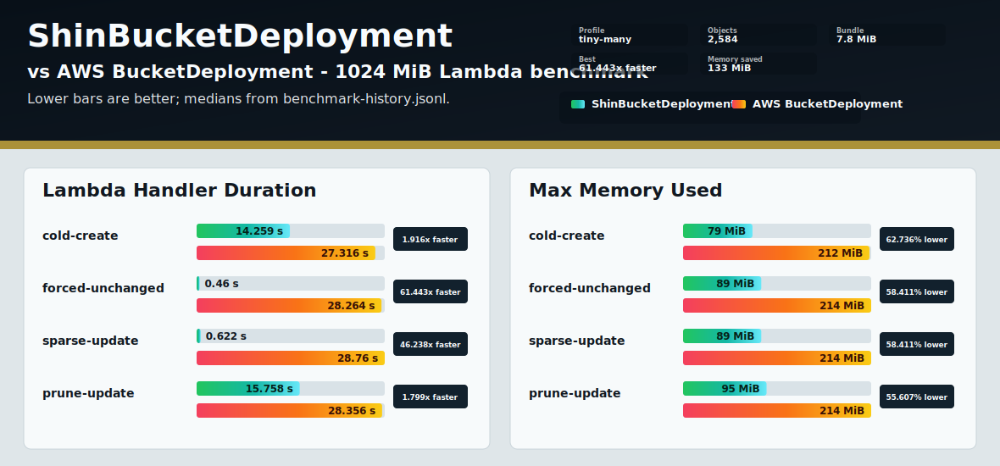
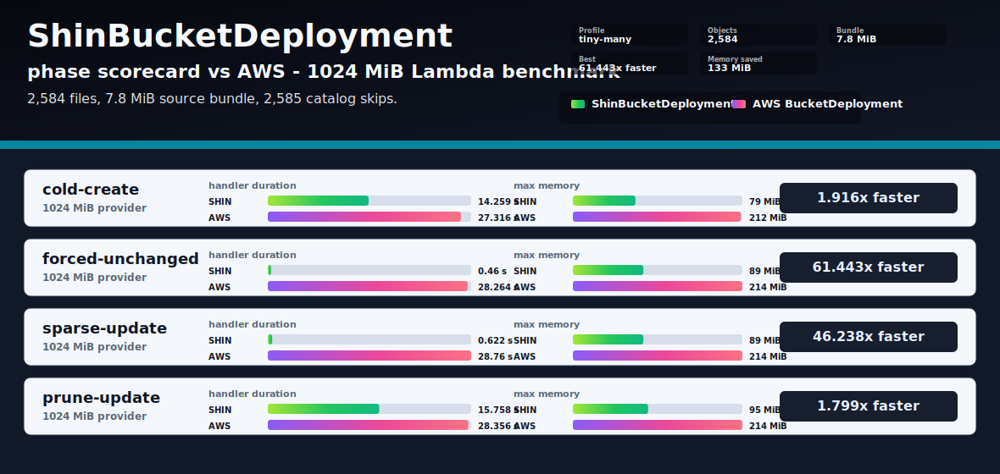
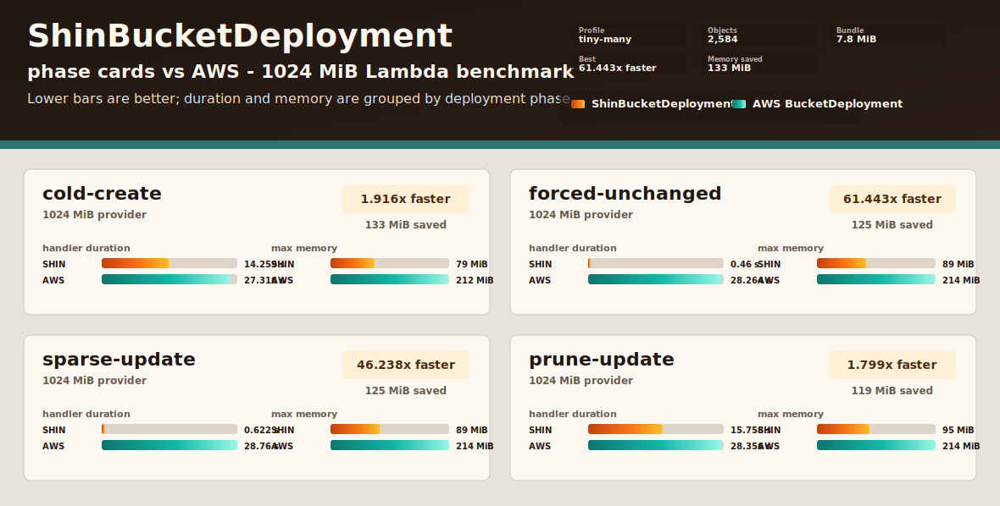

# Benchmark Chart Renderer Previews

These preview charts use the same sanitized `2026-05-09-rust-aws-tiny-many-1024` records from `docs/benchmark-history.jsonl`.

## Signal Split

Two metric panels, one for Lambda handler duration and one for max memory.

## Signal Scorecard

Phase-first rows. Each phase carries compact duration and memory bars, with the handler speedup called out on the right.

## Signal Cards

Each phase gets a larger card with speedup, memory saved, duration bars, and memory bars grouped together.

## Circuit Scorecard

Scorecard renderer with an alternate high-contrast palette.

## Circuit Cards

Card renderer with the alternate high-contrast palette.

## Forge Cards

Card renderer with a warmer palette.

