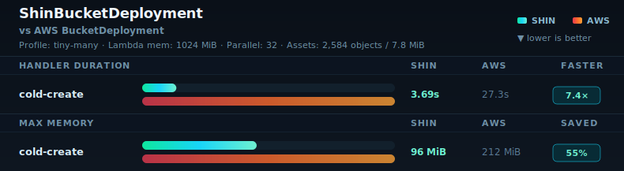
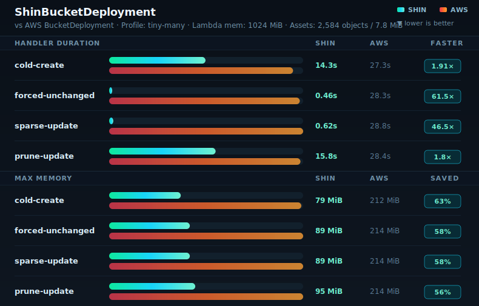
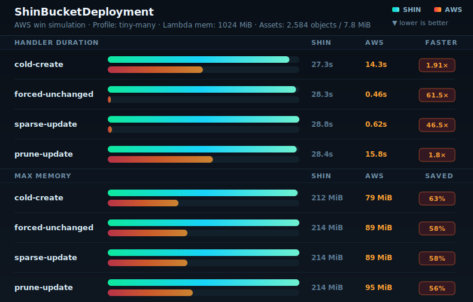
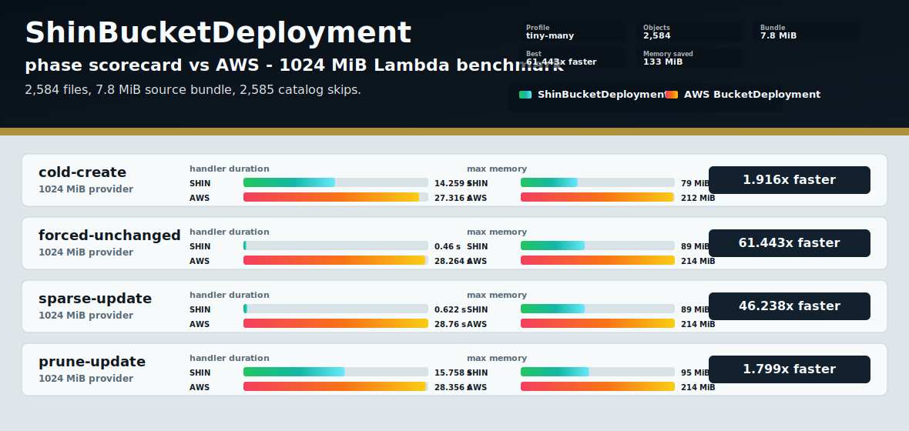
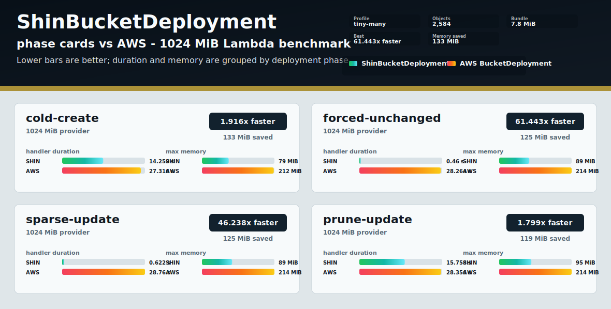

# Benchmark Chart Renderer Previews

The Signal Split v5 previews use sanitized tiny-many records from `docs/benchmark-history.jsonl`.
The default v5 chart keeps the four-phase 1024 MiB `maxParallelTransfers=8` Shin/AWS
comparison from `2026-05-09-shin-aws-tiny-many-1024`. The p32 preview uses the latest
1024 MiB Shin `maxParallelTransfers=32` cold-create row from
`2026-05-10-shin-tiny-many-parallel-transfers-1024` with the matching AWS cold-create row.

Preview-only SVGs live in `docs/benchmark-preview-assets`. The generated benchmark report chart remains in `docs/benchmark-assets`.

## Signal Split v5

Default current preview with compact bar tracks and a three-line header.

## Signal Split v5 Parallel 32

Cold-create-only preview using the latest tiny-many 1024 MiB Shin `maxParallelTransfers=32`
row.

## Signal Split v5 Two-line Header

Alternate compact header layout with comparison and metadata on one line.

## Signal Split v5 AWS Win Simulation

Simulated AWS-winning data to verify the winner-colored badge treatment.

## Earlier Renderer Previews

These are retained as design history.

### Signal Split v1

Two metric panels, one for Lambda handler duration and one for max memory.

### Signal Scorecard

Phase-first rows. Each phase carries compact duration and memory bars, with the handler speedup called out on the right.

### Signal Cards

Each phase gets a larger card with speedup, memory saved, duration bars, and memory bars grouped together.

### Circuit Scorecard

Scorecard renderer with an alternate high-contrast palette.

### Circuit Cards

Card renderer with the alternate high-contrast palette.

### Forge Cards

Card renderer with a warmer palette.

