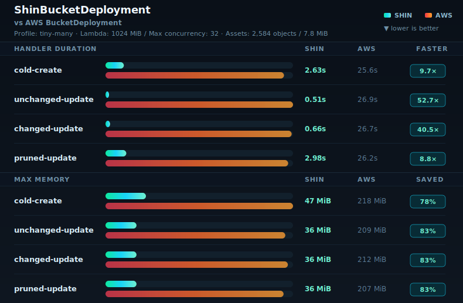
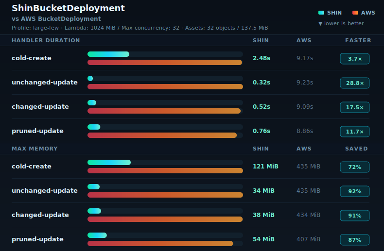

# Benchmark

This page is the compact benchmark index for `ShinBucketDeployment`. Benchmarks measure performance and efficiency; correctness verification lives in `docs/verification.md`.

Runbooks, evidence collection rules, schema guidance, and sanitization rules live in `.agents/skills/shin-benchmark/SKILL.md`.


<!-- benchmark-ci:start -->
## Latest CI benchmark

The latest complete canonical methodology-v2 run was collected by GitHub Actions on 2026-07-18 from source commit `35f7383`. It contains five sequential repetitions of both canonical profiles across all four phases. The sanitized run UUID is `035f539d-6995-4d10-98a0-b4e9a7c5749e`; raw AWS output remains outside git.

| Field | Value |
| --- | --- |
| Region | `eu-central-1` |
| Lambda configuration | 1024 MiB / 32 Shin transfers |
| Sanitized rows | 80 |
| Cleanup | all benchmark stacks destroyed |

| Profile | Phase | n | Provider s, Shin / AWS | AWS/Shin | Local wall s, Shin / AWS | Max MiB, Shin / AWS |
| --- | --- | ---: | ---: | ---: | ---: | ---: |
| `large-few` | `cold-create` | 5 | 2.484 / 9.169 | 3.691x | 73.637 / 78.814 | 121 / 435 |
| `large-few` | `unchanged-update` | 5 | 0.32 / 9.231 | 28.847x | 35.53 / 46.286 | 34 / 435 |
| `large-few` | `changed-update` | 5 | 0.523 / 9.085 | 17.371x | 37.006 / 47.137 | 38 / 434 |
| `large-few` | `pruned-update` | 5 | 0.762 / 8.86 | 11.627x | 36.402 / 52.421 | 54 / 407 |
| `tiny-many` | `cold-create` | 5 | 2.629 / 25.648 | 9.756x | 73.078 / 100.336 | 47 / 218 |
| `tiny-many` | `unchanged-update` | 5 | 0.512 / 26.881 | 52.502x | 35.425 / 62.866 | 36 / 209 |
| `tiny-many` | `changed-update` | 5 | 0.657 / 26.665 | 40.586x | 36.015 / 68.314 | 36 / 212 |
| `tiny-many` | `pruned-update` | 5 | 2.978 / 26.204 | 8.799x | 41.753 / 64.044 | 36 / 207 |

The [complete generated report](../benchmarks/ci-report.md) includes quartiles, end-to-end timings, and per-phase deltas. [Provider telemetry](../benchmarks/ci-telemetry.md) contains the sanitized Shin diagnostic tables.




<!-- benchmark-ci:end -->

## Methodology v2 status

The local methodology-v2 harness is implemented. The Rust module-refactor section below records a complete five-repetition decision run. Existing snapshots remain methodology-v1 historical evidence. Default report generation excludes historical and decision rows; use explicit selectors to inspect or regenerate them.

Methodology v2 requires five sequential repetitions, opaque UUID run and sample identities, a clean/dirty Git marker, exact package/CDK/provider identities, Lambda architecture, deployed code and Shin bootstrap SHA-256 values, phase-local execution-environment memory scope, and verified cleanup. A scratch resume manifest binds the source, normalized config, phases, destination, and exact sample matrix, while a two-phase ledger digest distinguishes runner persistence from preexisting or external evidence edits. Binary fixtures use deterministic SHA-256 counter bytes and a per-file digest manifest; retained files in prune phases are byte-identical to their baseline versions. AWS CDK rows use `parallel: null`; comparison pairing does not treat Shin parallelism as an upstream input.

AWS evidence remains approval-gated. Run one complete repetition per selected variant first, report elapsed time and the preliminary signal, agree a wall-clock cap, and only then resume repetitions 2–5 with the printed run UUID. Completed sanitized rows are persisted incrementally; raw AWS output remains outside the repository. The cap is enforced before stacks and between phases, at external-command granularity: an active CDK/AWS command may finish after the nominal deadline, after which cleanup begins. Signals terminate the active process group and also route the active stack through cleanup.

## Rust module refactor performance decision

The 2026-07-15 decision run compared the released pre-refactor provider at `ce3db3c`, the Rust module-refactor candidate at `0b63387`, and upstream AWS CDK `BucketDeployment`. The serialized run used deterministic `tiny-many` and `large-few` assets, 1024 MiB Lambda memory, 32 Shin transfers, the same four ordered phases, five repetitions, and the configured test profile in `eu-central-1`. Shin ran on arm64 and upstream ran on its shipped x86_64 default, so the upstream comparison is as shipped rather than architecture-normalized. Its 120 complete methodology-v2 rows are retained in `benchmarks/results.jsonl` under decision-run ID `rust-refactor-acceptance`.

CloudWatch provider duration is shown as median `[Q1, Q3]`, followed by IQR; every cell has `n=5`:

| Profile | Phase | Before seconds [Q1, Q3], IQR | Current seconds [Q1, Q3], IQR | Upstream seconds [Q1, Q3], IQR | Current vs before | Upstream / current |
| --- | --- | ---: | ---: | ---: | ---: | ---: |
| `tiny-many` | `cold-create` | 2.731 [2.495, 2.752], 0.257 | 2.957 [2.901, 3.545], 0.644 | 25.771 [25.584, 26.082], 0.498 | +8.3% | 8.7x |
| `tiny-many` | `unchanged-update` | 0.531 [0.514, 0.543], 0.029 | 0.467 [0.461, 0.482], 0.021 | 27.688 [27.484, 27.842], 0.358 | -12.1% | 59.3x |
| `tiny-many` | `changed-update` | 0.681 [0.679, 0.683], 0.004 | 0.617 [0.603, 0.638], 0.035 | 26.691 [25.354, 26.970], 1.616 | -9.4% | 43.3x |
| `tiny-many` | `pruned-update` | 3.256 [3.154, 3.279], 0.125 | 3.135 [3.128, 3.179], 0.051 | 25.457 [25.132, 26.648], 1.516 | -3.7% | 8.1x |
| `large-few` | `cold-create` | 2.397 [2.325, 2.475], 0.150 | 2.539 [2.499, 2.650], 0.151 | 9.091 [8.897, 9.112], 0.215 | +5.9% | 3.6x |
| `large-few` | `unchanged-update` | 0.321 [0.307, 0.346], 0.039 | 0.319 [0.282, 0.324], 0.042 | 8.876 [8.874, 9.272], 0.398 | -0.6% | 27.8x |
| `large-few` | `changed-update` | 0.586 [0.527, 0.604], 0.077 | 0.551 [0.544, 0.552], 0.008 | 9.300 [9.075, 9.367], 0.292 | -6.0% | 16.9x |
| `large-few` | `pruned-update` | 0.851 [0.777, 0.913], 0.136 | 0.812 [0.811, 0.855], 0.044 | 8.628 [8.625, 8.675], 0.050 | -4.6% | 10.6x |

Median billed duration and peak memory remained comparable to before:

| Profile | Phase | Billed seconds, before / current / upstream | Peak MiB, before / current / upstream |
| --- | --- | ---: | ---: |
| `tiny-many` | `cold-create` | 2.880 / 3.112 / 26.289 | 45 / 47 / 217 |
| `tiny-many` | `unchanged-update` | 0.678 / 0.595 / 28.245 | 36 / 36 / 210 |
| `tiny-many` | `changed-update` | 0.812 / 0.762 / 27.213 | 36 / 36 / 210 |
| `tiny-many` | `pruned-update` | 3.374 / 3.289 / 25.966 | 36 / 36 / 209 |
| `large-few` | `cold-create` | 2.516 / 2.667 / 9.614 | 114 / 118 / 433 |
| `large-few` | `unchanged-update` | 0.466 / 0.466 / 9.393 | 34 / 34 / 434 |
| `large-few` | `changed-update` | 0.702 / 0.698 / 9.850 | 36 / 38 / 433 |
| `large-few` | `pruned-update` | 1.008 / 0.933 / 9.142 | 55 / 54 / 405 |

Six of eight current provider-duration medians improved or stayed effectively flat. The two cold-create medians increased by 5.9% and 8.3%, with overlapping quartile ranges, while median end-to-end local wall time decreased from 65.445 to 64.998 seconds for `tiny-many` and from 65.050 to 64.777 seconds for `large-few`. Current remained 3.6x to 59.3x faster than upstream in provider time across all eight cells.

Before and current performed identical logical work across the 40 Shin phases: 51,005 planned entries, 13,130 uploads, 37,875 skips, 1,315 stale deletions, 37,875 catalog skips, 844,034,960 uploaded bytes, and no marker passes. Both had zero source GET retries/errors, destination throttles, and transfer failures/cancellations/panics. Resident-source high-water was identical at 33,442,577 bytes.

One retained current `tiny-many` cold-create sample encountered nine non-throttling failed PUT attempts. Provider-owned retries completed all 2,584 logical transfers, adding nine source-body replays, eight replay-after-release block refetches, 7,615,416 fetched source bytes, and 1.111 seconds of retry wait relative to the normal path. The other four current samples in that cell and all 40 before samples had zero PUT retries. This isolated destination-request instability explains the high current Q3/IQR and is retained rather than discarded; it does not indicate a new unconditional pass or request in the refactored path.

The complete matrix therefore accepts the structural refactor as having no detected systematic performance regression or new normal-path work. Every sample captured complete provider telemetry, destroyed its benchmark stack, and passed the final scoped cleanup check. Raw AWS output remains outside git.

## Where To Look

| Artifact | Purpose |
| --- | --- |
| `benchmarks/README.md` | Human-viewable benchmark snapshots and links to committed SVG charts. |
| `benchmarks/telemetry.md` | Historical methodology-v1 Markdown snapshot of Shin provider telemetry grouped by profile, memory, parallelism, and phase. |
| `benchmarks/results.jsonl` | Structured sanitized benchmark result rows used by reports and profile snapshots. |
| `benchmarks/configs/` | Curated benchmark run matrices. |
| `benchmarks/src/` | Benchmark runner, collector, table renderer, report renderer, and profile-snapshot renderer. |

## PR #12 Performance Decision Run

PR #12's encryption-aware change was accepted from a controlled three-repetition AWS run on 2026-07-12. The run used the configured test profile in `eu-central-1`, serialized stacks (`concurrency=1`), 2048 MiB Lambda memory, 32 parallel transfers, identical deterministic assets, and the same four ordered phases for each implementation. Values below are medians from CloudWatch `REPORT` records; memory is peak Lambda memory for the same phase.

The `before` implementation is `8134576`, the universal-checksum PR #12 candidate. The current SSE-S3 implementation is `3bcd033`; the managed-KMS measurements use the provider fix captured by `7a910f4`. Upstream is AWS CDK 2.260.0 `BucketDeployment`. The KMS provider binary was rebuilt from `7a910f4` and staged into the otherwise identical benchmark app.

### SSE-S3 fast path

| Profile | Phase | Provider seconds, before / current / upstream | Current vs before | Upstream / current | Peak MiB, before / current / upstream |
| --- | --- | ---: | ---: | ---: | ---: |
| `tiny-many` | `cold-create` | 2.595 / 2.447 / 14.844 | -5.7% | 6.1x | 105 / 89 / 220 |
| `tiny-many` | `unchanged-update` | 0.426 / 0.354 / 15.208 | -16.9% | 43.0x | 105 / 89 / 220 |
| `tiny-many` | `changed-update` | 0.570 / 0.513 / 14.966 | -10.0% | 29.2x | 105 / 89 / 220 |
| `tiny-many` | `pruned-update` | 4.263 / 3.721 / 14.109 | -12.7% | 3.8x | 142 / 112 / 220 |
| `large-few` | `cold-create` | 1.668 / 1.089 / 4.351 | -34.7% | 4.0x | 231 / 143 / 351 |
| `large-few` | `unchanged-update` | 0.195 / 0.187 / 4.058 | -4.1% | 21.7x | 231 / 143 / 352 |
| `large-few` | `changed-update` | 0.398 / 0.379 / 3.974 | -4.8% | 10.5x | 231 / 143 / 352 |
| `large-few` | `pruned-update` | 1.460 / 1.033 / 3.905 | -29.2% | 3.8x | 231 / 144 / 352 |

All 24 current Shin phase records selected `sse-s3-etag`. They reported zero MD5 comparison-hash attempts, destination PUT retries or throttles, and source GET retries or errors. The unchanged and changed phases used authenticated catalog skips instead of a universal SHA-256 pass; cold and pruned phases calculated MD5 only alongside bytes already being validated and uploaded.

### AWS-managed KMS path

| Phase | Provider seconds, before / current / upstream | Current vs before | Upstream / current | Peak MiB, before / current / upstream |
| --- | ---: | ---: | ---: | ---: |
| `cold-create` | 1.695 / 1.708 / 4.362 | +0.8% | 2.6x | 228 / 233 / 352 |
| `unchanged-update` | 1.523 / 1.489 / 3.907 | -2.2% | 2.6x | 237 / 238 / 352 |
| `changed-update` | 1.482 / 1.532 / 4.038 | +3.4% | 2.6x | 244 / 249 / 353 |
| `pruned-update` | 1.441 / 1.441 / 3.901 | 0.0% | 2.7x | 244 / 249 / 353 |

All 12 current Shin phase records selected `kms-sha256` and reported zero PUT retries or throttles and zero source GET retries or errors. The necessary stored-checksum plus independent-digest work therefore stayed within -2.2% to +3.4% of the original PR #12 provider duration and 0.4% to 2.2% of its median peak memory across the four phases. It still completed provider work about 2.6x to 2.7x faster than upstream.

These rows are decision evidence for the checksum redesign, not a replacement for the repository's canonical snapshot. The temporary before/current and encryption variants do not fit the current JSONL upsert identity without overwriting one another, and broader methodology-v2/CI regression work remains separate. Raw logs and individual rows remain outside git. Every benchmark stack was destroyed, and a final scoped check found none remaining.

## Transfer scheduler performance decision

The 2026-07-13 transfer-scheduler decision run completed five `before` repetitions, five `current` repetitions, and four `upstream` repetitions before the maintainer stopped the final upstream repetition to cap time and cost. The maintainer accepted the completed evidence as sufficient to proceed to PR review. The 112 sanitized phase rows are retained in `benchmarks/results.jsonl` under decision-run ID `transfer-scheduler-2026-07-13`. Each repetition contains `tiny-many` and `large-few` at 2048 MiB / 32 transfers across the four ordered phases, with stacks serialized at concurrency 1 in `eu-central-1`.

The benchmark app uses a benchmark-only per-phase custom-resource token so `unchanged-update` always invokes the provider without changing the asset, destination, or provider algorithm. Decision rows include `decisionRunId`, `comparisonVariant`, and `repetition`; these fields are part of the upsert identity so repeated samples cannot replace one another. Canonical snapshot renderers exclude decision rows by default, while the JSONL remains available for later aggregate analysis.

Median CloudWatch provider duration and peak-memory results:

| Profile | Phase | Provider seconds, before / current / upstream | Current vs before | Upstream / current | Peak MiB, before / current / upstream |
| --- | --- | ---: | ---: | ---: | ---: |
| `tiny-many` | `cold-create` | 2.570 / 2.376 / 14.409 | -7.5% | 6.1x | 90 / 48 / 221 |
| `tiny-many` | `unchanged-update` | 0.404 / 0.382 / 14.283 | -5.4% | 37.4x | 90 / 48 / 221 |
| `tiny-many` | `changed-update` | 0.541 / 0.521 / 14.581 | -3.7% | 28.0x | 90 / 56 / 221 |
| `tiny-many` | `pruned-update` | 3.699 / 3.664 / 14.024 | -0.9% | 3.8x | 111 / 60 / 221 |
| `large-few` | `cold-create` | 1.146 / 0.971 / 4.335 | -15.3% | 4.5x | 145 / 97 / 351 |
| `large-few` | `unchanged-update` | 0.206 / 0.196 / 3.894 | -4.9% | 19.9x | 145 / 97 / 351 |
| `large-few` | `changed-update` | 0.403 / 0.372 / 3.931 | -7.7% | 10.6x | 145 / 97 / 352 |
| `large-few` | `pruned-update` | 1.009 / 0.931 / 3.837 | -7.7% | 4.1x | 146 / 97 / 352 |

Current improved on before in every median phase, by 0.9% to 15.3%, while using materially less peak memory. Upstream required 3.8x to 37.4x the current provider duration. Across all 40 current rows, source GET and destination PUT retries, throttled attempts, transfer failures, cancellations, panics, and consumed body replays were zero. Transfer in-flight high-water reached the configured bound of 32 and active readers peaked at 27.

The interrupted fifth upstream repetition is not represented as complete evidence. Raw AWS output remains outside git, every completed repetition performed its own cleanup, the interrupted stack was deleted separately, and the final scoped stack count was zero.

## Marker replacement performance decision

The 2026-07-14 corrected marker-replacement decision run completed one `before`, one `current`, and one `upstream` repetition, as requested for this confirmation. Its nine sanitized rows are retained in `benchmarks/results.jsonl` under decision-run ID `marker-replacement-stable-2026-07-14`. Every variant used the `marker-heavy` profile, a stable 16 MiB marker-bearing object plus four small ordinary files, 2048 MiB Lambda memory, 32 parallel transfers, serialized stacks, and the same create/unchanged/changed phase order in `eu-central-1`.

The earlier five-repetition fixture padded around unresolved CDK token text. Placeholder lengths could change between syntheses, shifting the resolved marker body by 16 to 32 bytes and causing spurious unchanged uploads: its `before` rows alternated between zero and one marker upload, while its `current` rows alternated in the opposite pattern. The corrected fixture pads against fixed resolved parameter defaults. Both corrected Shin unchanged phases uploaded zero objects and skipped all six. The flawed 45 rows were removed from current-result data.

The `before` provider is benchmark-harness commit `b11e26c`, whose provider source still matches `main` before streaming marker replacement; only the stable fixture was applied in a detached benchmark checkout. The current provider is `3967fec`. Upstream is AWS CDK 2.260.0 `BucketDeployment`. Values are single CloudWatch `REPORT` records per cell, not multi-sample medians.

| Phase | Provider seconds, before / current / upstream | Billed seconds, before / current / upstream | Current vs before | Upstream / current | Peak MiB, before / current / upstream |
| --- | ---: | ---: | ---: | ---: | ---: |
| `cold-create` | 3.483 / 0.630 / 5.273 | 3.603 / 0.779 / 5.798 | -81.9% | 8.4x | 66 / 38 / 196 |
| `unchanged-update` | 3.182 / 0.289 / 4.895 | 3.182 / 0.290 / 4.895 | -90.9% | 16.9x | 71 / 38 / 198 |
| `changed-update` | 3.522 / 0.551 / 5.002 | 3.523 / 0.551 / 5.003 | -84.4% | 9.1x | 71 / 38 / 199 |

End-to-end timings remained comparable while provider work improved materially:

| Phase | CDK deploy seconds, before / current / upstream | Local wall seconds, before / current / upstream |
| --- | ---: | ---: |
| `cold-create` | 55.03 / 54.68 / 54.66 | 68.433 / 66.412 / 72.865 |
| `unchanged-update` | 11.28 / 11.26 / 11.30 | 21.221 / 19.824 / 19.789 |
| `changed-update` | 11.23 / 11.18 / 11.26 | 26.239 / 24.899 / 24.477 |

Current telemetry makes the pass tradeoff explicit. Every marker entry used one bounded planning pass to determine exact `Content-Length`, validate source size/CRC/catalog integrity, and calculate the SSE-S3 comparison digest. Cold create and changed update then used one retryable streaming upload pass; unchanged update matched the destination after planning and used no upload pass. Current source fetches were therefore 150,359 bytes for create, 74,308 bytes for unchanged, and 149,046 bytes for changed. The two-pass phases each recorded one deliberate replay-after-release refetch. This is local source-block replay, not S3 pressure: all six Shin rows reported zero source GET retries/errors and zero destination PUT retries/throttles.

The current provider used 42.4% to 46.5% less peak memory than before and was 5.5x to 11.0x faster in provider time. It remained 8.4x to 16.9x faster than upstream while using about one fifth of upstream peak memory. As a historical cross-check, all nine corrected provider-time cells were within 6.1% of the superseded five-run medians. The measured extra read on upload phases is therefore accepted: it removes whole-entry output buffering, preserves exact/retryable `PutObject` bodies, and still improves both time and memory materially.

Raw AWS output remains outside git. Every repetition captured provider telemetry before cleanup, destroyed its stack, and verified stack absence.

## Invocation memory planning performance decision

The corrected 2026-07-14 invocation-memory decision run completed one `before`, one `current`, and one `upstream` repetition. Its nine sanitized rows are retained in `benchmarks/results.jsonl` under decision-run ID `memory-planning-gated-2026-07-14`. Every variant used the `multi-source-prune` profile at 1024 MiB / 32 transfers, serialized stacks, and the same create, unchanged, and prune phases in `eu-central-1`. Values are single CloudWatch `REPORT` records, not multi-sample medians.

The `before` provider is benchmark-harness commit `add1c20`, whose provider source matches PR #14's merged baseline. The current provider is `af7873d`. Upstream is AWS CDK 2.260.0 `BucketDeployment`. The earlier PR #15 candidate and its unconditional post-transfer destination scan were rejected; its stale rows and claims are not retained.

| Phase | Provider seconds, before / current / upstream | Current vs before | Upstream / current | Peak MiB, before / current / upstream |
| --- | ---: | ---: | ---: | ---: |
| `cold-create` | 2.288 / 1.980 / 23.221 | -13.5% | 11.7x | 48 / 50 / 240 |
| `unchanged-update` | 0.607 / 0.459 / 22.749 | -24.4% | 49.6x | 48 / 51 / 240 |
| `pruned-update` | 2.747 / 2.755 / 18.796 | +0.3% | 6.8x | 53 / 51 / 240 |

Current bounds retained destination metadata to manifest keys and the page working set to at most 1,000 objects. The initial destination listing now records whether an exact included non-manifest key exists, so the post-transfer page scan runs only when stale cleanup has actual candidates. Cold create retained no destination metadata, unchanged retained 1,284 manifest keys without entering deletion, and prune retained 129 manifest keys while deleting 1,155 stale objects in two batches.

All six Shin rows reported zero source GET retries/errors, destination PUT retries/throttles, transfer failures, cancellations, panics, and consumed body replays. Current source memory returned to zero after every invocation; its high-water remained below the exact 536,870,912-byte global budget. Every benchmark stack was destroyed, and a final scoped check found none remaining. Raw AWS output remains outside git.

## Current Snapshot

> [!CAUTION]
> The README charts use exploratory single-sample methodology. Do not use them to select production defaults.

| Field | Value |
| --- | --- |
| Snapshot date | 2026-07-18 |
| Source commit | `c6a97be` |
| Region | `eu-central-1` |
| Implementations | `shin` and upstream AWS CDK `BucketDeployment` |
| Asset profile | `tiny-many` |
| Lambda configurations | 1024 MiB / 32 Shin transfers; 2048 MiB / 64 Shin transfers |
| Phases | `cold-create`, `unchanged-update`, `changed-update`, `pruned-update` |
| Cleanup | All benchmark stacks destroyed after telemetry collection |
| Raw evidence | Not committed; raw AWS output remains in scratch only |

## Reading Results

Use `benchmarks/README.md` first for visual snapshots. The currently committed `benchmarks/telemetry.md` is a historical methodology-v1 view; use it when you need detailed telemetry for those snapshot rows, including runtime timings, provider phase timing, object work, transfer-scheduler completion/cancellation, source range-read diagnostics, bytes/memory windows, consumed body replays, and `PutObject` pressure.

Regenerate the Shin telemetry Markdown tables from the JSONL source with:

```bash
pnpm benchmark:telemetry-table -- --methodology-version 1
```

Generate filtered comparison reports with:

```bash
pnpm benchmark:comparison-report -- --methodology-version 1 --asset-profile tiny-many --lambda-memory-mb 2048 --lambda-max-parallel-transfers 64
```

## Methodology Summary

The benchmark harness measures deterministic static-site bundles across create, unchanged, changed-update, and pruned-update phases. Paired Shin-vs-AWS comparison runs must use the same region, asset profile, states, destination prefix, memory setting, and repetition count.

The `assets` benchmark scenario generates deterministic bundles under `.benchmark-assets/`, which is ignored by git. The same stack definition can instantiate either `ShinBucketDeployment` or upstream AWS CDK `BucketDeployment`; the implementation is the intended comparison dimension.

## Telemetry Notes

Shin rows may include sanitized `shin_deployment_summary` telemetry. Schema-v3 summaries separate deployment work status from callback delivery, logical transfer objects from source and destination upload wire attempts, and deletion SDK calls from inferred object outcomes. They also expose consumed body replays, typed throttling/errors, cancellations, invocation-global source memory, destination metadata/page high-water, and callback attempts; historical rows may not contain every field. Use `docs/architecture.md` for exact diagnostics meanings.

Do not infer S3 throttling from source block waits alone. Source S3 pressure requires source `getRetries` or `getErrors`; destination S3 throttling requires `putObject.throttledAttempts` or retry evidence.

Do not commit `.benchmark-runs/` or other raw AWS output. Commit only sanitized result rows, Markdown/SVG render outputs, configs, source, and tests.
