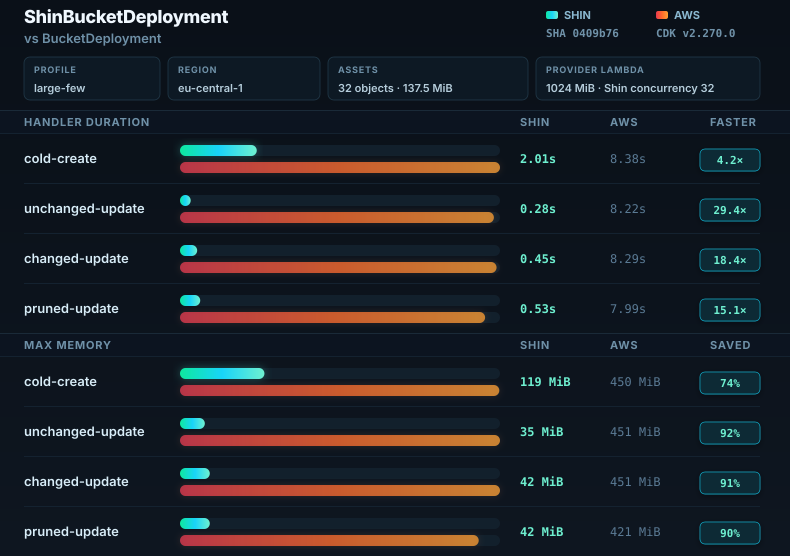
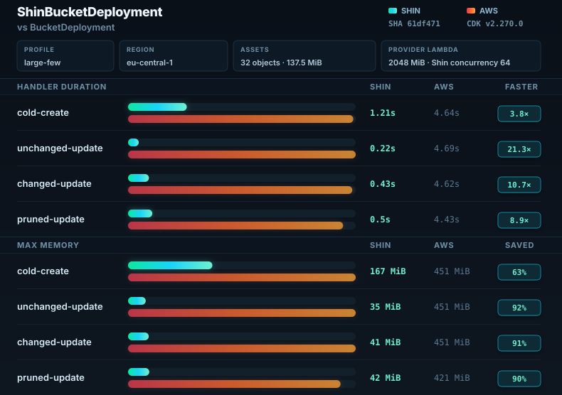
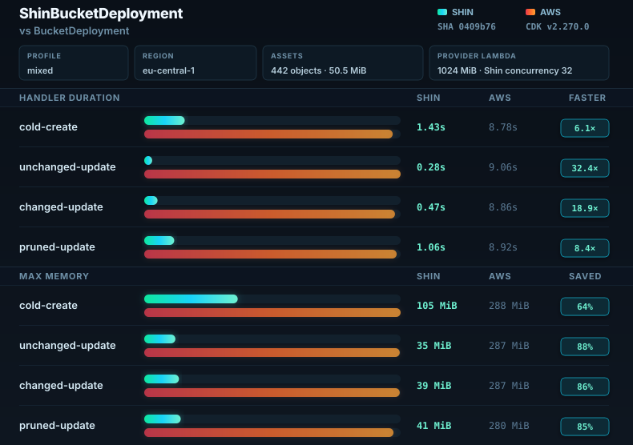
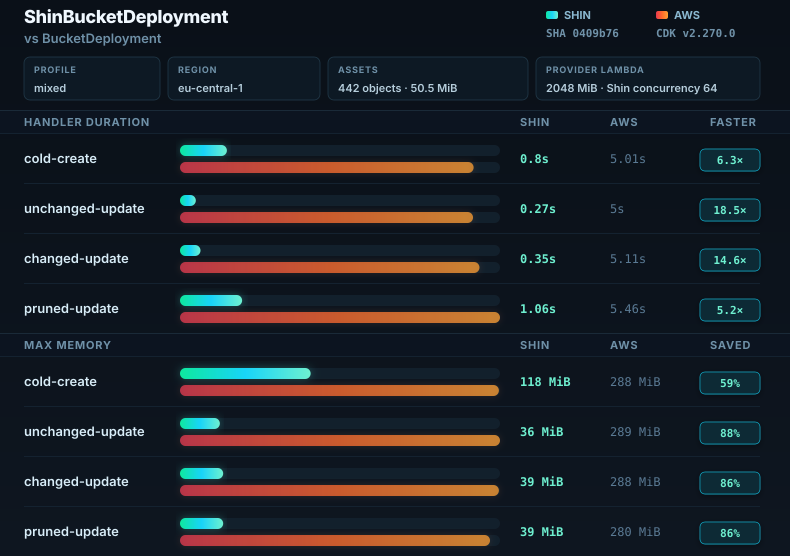
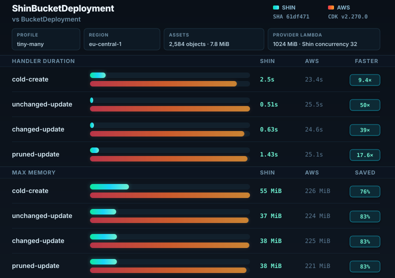
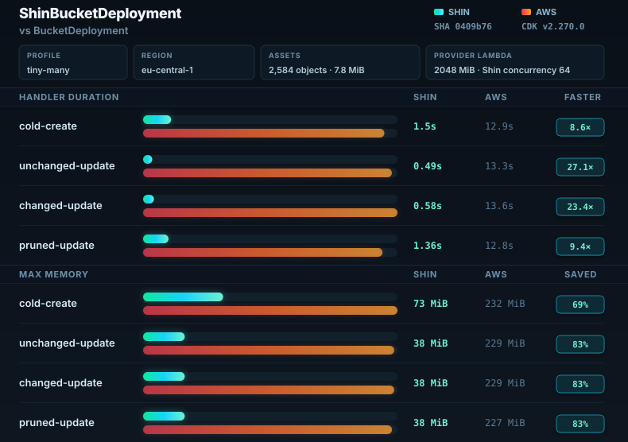

# Benchmark

This page is the compact benchmark index for `ShinBucketDeployment`. Benchmarks measure performance and efficiency; correctness verification lives in `docs/verification.md`.

Runbooks, evidence collection rules, schema guidance, and sanitization rules live in `.agents/skills/shin-benchmark/SKILL.md`.

Provider-summary schema-5 result rows, their generated reports, and their chart live in `archive/` and are not current evidence.

<!-- benchmark-ci:start -->

## Latest CI benchmark

The latest complete canonical methodology-v2 run was collected by GitHub Actions on 2026-08-06 from source commit `3d33549`. It contains five sequential repetitions of all canonical profiles across all four phases. The sanitized run UUID is `e654d1fe-261d-4700-95af-0a7518520e5a`; raw AWS output remains outside git.

| Field                 | Value                                                      |
| --------------------- | ---------------------------------------------------------- |
| Region                | `eu-central-1`                                             |
| Lambda configurations | 1024 MiB / 32 Shin transfers, 2048 MiB / 64 Shin transfers |
| Sanitized rows        | 240                                                        |
| Cleanup               | all benchmark stacks destroyed                             |

| Profile     | Phase              |   n | Provider s, Shin / AWS | AWS/Shin | Local wall s, Shin / AWS | Max MiB, Shin / AWS |
| ----------- | ------------------ | --: | ---------------------: | -------: | -----------------------: | ------------------: |
| `large-few` | `cold-create`      |   5 |           2.562 / 8.99 |   3.509x |          68.923 / 78.966 |           109 / 447 |
| `large-few` | `cold-create`      |   5 |          1.217 / 5.058 |   4.156x |          68.861 / 68.019 |           187 / 447 |
| `large-few` | `unchanged-update` |   5 |          0.312 / 9.238 |  29.609x |          32.827 / 41.771 |            32 / 447 |
| `large-few` | `unchanged-update` |   5 |           0.251 / 4.98 |  19.841x |          36.361 / 36.436 |            32 / 447 |
| `large-few` | `changed-update`   |   5 |          0.616 / 9.244 |  15.006x |          37.082 / 47.249 |            39 / 447 |
| `large-few` | `changed-update`   |   5 |          0.537 / 5.075 |   9.451x |           36.89 / 41.948 |            39 / 447 |
| `large-few` | `pruned-update`    |   5 |          0.694 / 8.468 |  12.202x |          37.683 / 47.362 |            39 / 417 |
| `large-few` | `pruned-update`    |   5 |          0.578 / 4.796 |   8.298x |           37.44 / 42.087 |            39 / 417 |
| `mixed`     | `cold-create`      |   5 |          1.382 / 9.584 |   6.935x |           69.06 / 74.189 |           103 / 281 |
| `mixed`     | `cold-create`      |   5 |          0.828 / 5.629 |   6.798x |          74.197 / 73.773 |           116 / 282 |
| `mixed`     | `unchanged-update` |   5 |         0.312 / 10.041 |  32.183x |          31.425 / 42.156 |            33 / 281 |
| `mixed`     | `unchanged-update` |   5 |          0.286 / 5.702 |  19.937x |          31.349 / 36.679 |            34 / 282 |
| `mixed`     | `changed-update`   |   5 |            0.628 / 9.7 |  15.446x |          37.242 / 48.532 |            37 / 280 |
| `mixed`     | `changed-update`   |   5 |          0.414 / 5.623 |  13.582x |          37.521 / 41.992 |            37 / 281 |
| `mixed`     | `pruned-update`    |   5 |          1.286 / 9.473 |   7.366x |          36.653 / 47.306 |            37 / 273 |
| `mixed`     | `pruned-update`    |   5 |          1.192 / 5.552 |   4.658x |          36.883 / 42.337 |            37 / 274 |
| `tiny-many` | `cold-create`      |   5 |         2.632 / 24.333 |   9.245x |          70.911 / 94.642 |            55 / 219 |
| `tiny-many` | `cold-create`      |   5 |         1.524 / 14.325 |     9.4x |           69.346 / 80.52 |            64 / 222 |
| `tiny-many` | `unchanged-update` |   5 |         0.515 / 25.116 |  48.769x |          31.758 / 62.939 |            35 / 212 |
| `tiny-many` | `unchanged-update` |   5 |         0.527 / 14.419 |  27.361x |           32.94 / 47.532 |            35 / 221 |
| `tiny-many` | `changed-update`   |   5 |         0.664 / 25.264 |  38.048x |          37.186 / 63.873 |            36 / 214 |
| `tiny-many` | `changed-update`   |   5 |         0.648 / 14.385 |  22.199x |           37.171 / 53.15 |            36 / 221 |
| `tiny-many` | `pruned-update`    |   5 |         1.516 / 23.925 |  15.782x |           38.02 / 63.798 |            36 / 211 |
| `tiny-many` | `pruned-update`    |   5 |         1.361 / 13.743 |  10.098x |          37.263 / 53.201 |            35 / 218 |

The [complete generated report](../benchmarks/ci-report.md) includes quartiles, end-to-end timings, and per-phase deltas. [Provider telemetry](../benchmarks/ci-telemetry.md) contains the sanitized Shin diagnostic tables.













<!-- benchmark-ci:end -->

## Methodology

Methodology v2 is the only methodology. It requires five sequential repetitions, opaque UUID run and sample identities, a clean Git tree, exact package/CDK/provider identities, Lambda architecture, deployed code and Shin bootstrap SHA-256 values, phase-local execution-environment memory scope, and verified cleanup. A scratch resume manifest binds the source, normalized config, phases, destination, and exact sample matrix, while a two-phase ledger digest distinguishes runner persistence from preexisting or external evidence edits. Binary fixtures use deterministic SHA-256 counter bytes and a per-file digest manifest; retained files in stale-deletion phases are byte-identical to their baseline versions. AWS CDK rows use `parallel: null`; comparison pairing does not treat Shin parallelism as an upstream input.

Diagnostics are always on: a run cannot opt out of detailed failure diagnostics.

AWS evidence remains approval-gated. Run one complete repetition per selected variant first, report elapsed time and the preliminary signal, agree a wall-clock cap, and only then resume repetitions 2–5 with the printed run UUID. Completed sanitized rows are persisted incrementally; raw AWS output remains outside the repository. The cap is enforced before stacks and between phases, at external-command granularity: an active CDK/AWS command may finish after the nominal deadline, after which cleanup begins. Signals terminate the active process group and also route the active stack through cleanup.

## Where To Look

| Artifact                   | Purpose                                                                                      |
| -------------------------- | -------------------------------------------------------------------------------------------- |
| `benchmarks/README.md`     | Benchmark runbook and current publication state.                                             |
| `benchmarks/results.jsonl` | Structured sanitized current benchmark result rows used by reports and profile snapshots.    |
| `benchmarks/configs/`      | Curated benchmark run matrices.                                                              |
| `benchmarks/src/`          | Benchmark runner, collector, table renderer, report renderer, and profile-snapshot renderer. |

## Reading Results

When a schema-6 run is published, use its generated report and telemetry files for quartiles, per-phase deltas, and provider diagnostics: runtime timings, provider phase timing, object work, transfer-scheduler completion/cancellation, source range-read diagnostics, bytes/memory windows, consumed body replays, and destination-write pressure.

Regenerate the Shin telemetry tables from the JSONL source with:

```bash
pnpm benchmark:telemetry-table -- --run-id <uuid>
```

Generate filtered comparison reports with:

```bash
pnpm benchmark:comparison-report -- --run-id <uuid> --asset-profile mixed --lambda-memory-mb 2048 --transfer-max-concurrency 64
```

Rendering validates every required field and the exact matrix from the canonical config before it emits a report, telemetry table, or README snapshot; missing, duplicate, dirty, incomplete, or unplanned cells fail rendering. Tables report `n`, median, Q1, Q3, and IQR.

## Methodology Summary

The benchmark harness measures deterministic static-site bundles across create, unchanged, changed-update, and stale-deletion-update phases. Paired Shin-vs-AWS comparison runs must use the same region, asset profile, states, destination prefix, memory setting, and repetition count.

The `assets` benchmark scenario generates deterministic bundles under `.benchmark-assets/`, which is ignored by git. The same stack definition can instantiate either `ShinBucketDeployment` or upstream AWS CDK `BucketDeployment`; the implementation is the intended comparison dimension.

## Telemetry Notes

Shin rows require sanitized `shin_deployment_summary` telemetry at schema v6. It separates deployment work status from callback delivery, logical transfer objects from source and destination upload wire attempts, and deletion SDK calls from inferred object outcomes. It also exposes consumed body replays, typed throttling/errors, cancellations, invocation-global source memory and release anomalies, destination metadata/page high-water, callback attempts, bounded sanitized `PutObject` SDK/service classifications with correlated body/source failure groups, and direct-copy retry and throttle counters. Use `docs/architecture.md` for exact diagnostics meanings.

Do not infer S3 throttling from source block waits alone. Source S3 pressure requires source `getRetries` or `getErrors`; destination S3 throttling requires `putObject.throttledAttempts` or retry evidence for extracted uploads, and `copyObject.throttledAttempts` or retry evidence for direct copies.

Do not commit `.benchmark-runs/` or other raw AWS output. Commit only sanitized result rows, Markdown/SVG render outputs, configs, source, and tests.

## Destination-cleanup follow-up: planning-overhead attribution

The P-4/P-6/R-1 destination-cleanup decision run (`95f84950`, five repetitions at
`b281f03`, `mixed` 2048/64) reported planning rising from a 171 ms median to
273 ms against the `20313b6` baseline (`9af64d64`), and concluded the rise
"coincides with the new per-key stale-key retention path but this run does not
isolate its cause." A follow-up attribution review (2026-08-05) now isolates it,
using only the committed sanitized rows plus a host micro-measurement:

- **The retention path is not the cause.** The implementation PR touched only
  `destination.rs`, `s3/mod.rs`, and `cloudformation.rs` — the source planner is
  byte-identical between the two runs, yet the `plan` phase rose across _all_
  phases, including `cold-create` with an empty destination: 174→284
  (`cold-create`), 159→199 (`unchanged-update`), 170→282 (`changed-update`),
  171→273 (`pruned-update`). The phase the change actually modified
  (`destinationList`) stayed flat at 66→62 ms. Same-day control runs with an
  untouched plan path (P-2 marker evidence, `5bfec7df` vs `7a77a569`) swing the
  `plan` median by 66–107 ms between runs, so the reported +102 ms is
  inter-run platform noise, not a code regression.
- **The per-key retention cost is measurable and tiny.** Host-build
  micro-measurement of the exact listing-loop work (442 keys, 45 stale, empty
  filters) shows the P-6 retention path adds ~16 ns per listed key (53→67 ns
  per key); the second previous-namespace predicate on destination moves adds
  ~58 ns per key. On the 442-object benchmark namespace that is roughly 7–30 µs
  total — five orders of magnitude below the reported delta. A bounded
  regression test now guards the per-key cost.
- **The small-delete latency is service-bound.** Both runs delete exactly 45
  objects in one `DeleteObjects` call with zero retries; the median delete phase
  moved 623→674 ms, which is inside the baseline run's own 620–757 ms spread.
  45 < 1000, so batching is already a single call, and the provider-owned retry
  (R-1) only adds time when the service fails. There is no provider-side lever
  for the fixed per-call latency; treat it as documented service cost.
- **What changed:** the planning loop now shares one prefix strip and one
  manifest lookup between the current-namespace stale predicate and the
  previous-namespace predicate (previously two strips and two lookups per key
  on destination moves). Behavior is identical — an equivalence test proves the
  fused per-key decisions match the standalone predicates for every listing key
  shape. No performance acceptance is claimed for this change: at benchmark
  scale the saving is below run noise, and the real planning cost driver
  remains per-entry source planning (P-9's remaining bullets).
