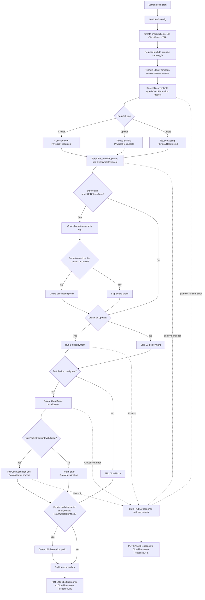
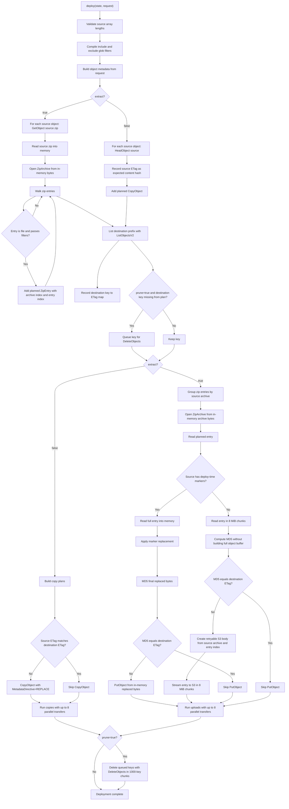
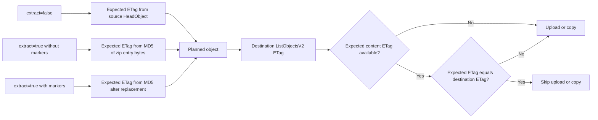
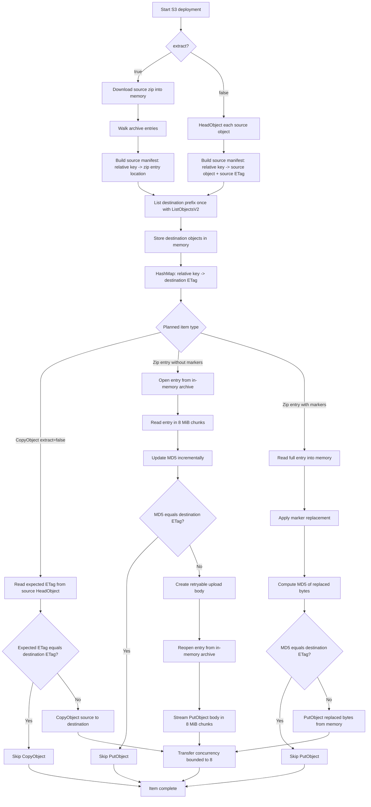

# Lambda Workflow

This document shows the current runtime workflow for the `RustBucketDeployment` provider Lambda.

## GitHub Theme Support

The diagrams below use GitHub-flavored Markdown Mermaid code blocks instead of static images, so GitHub renders them in the viewer's current light or dark theme. If these diagrams are ever exported to image files, use GitHub's theme-aware `<picture>` pattern:

```html
<picture>
  <source media="(prefers-color-scheme: dark)" srcset="diagram-dark.png">
  <source media="(prefers-color-scheme: light)" srcset="diagram-light.png">
  
</picture>
```

## Handler Overview



## S3 Deployment Workflow



## ETag Decision Path



## File Upload Handling

The destination ETags are listed once per deployment after the source plan is built. They are stored in memory as a key-to-ETag map, not as the upload payload itself.



For plain zip entries, the handler does not load the whole entry into an upload buffer. It reads chunks to compute MD5, compares against the destination ETag map, and only if changed creates a streaming `PutObject` body that emits 8 MiB chunks. With 8 active upload streams, the queued chunk payloads are bounded by the transfer concurrency.

## Current Runtime Notes

- Source zip archives are downloaded into Lambda memory and then opened as `ZipArchive` readers.
- Plain zip entries are hashed in 8 MiB chunks. If changed, the upload stream reopens the entry from the in-memory archive and sends one 8 MiB chunk at a time.
- The upload stream is retryable because the body can be rebuilt from the retained in-memory source archive.
- Zip entries with deploy-time replacements are still fully materialized in memory after replacement, because the final bytes must be known before computing the ETag and uploading.
- The handler does not extract the archive to disk and does not stage zip entries in `/tmp`.
- Copy and upload transfers are bounded by `MAX_PARALLEL_TRANSFERS = 8`.
- `prune=true` lists the destination prefix and deletes destination objects that are not in the planned source set.
- CloudFront invalidation is created after S3 deployment or delete handling; if waiting is enabled, the handler polls until completion or timeout.
