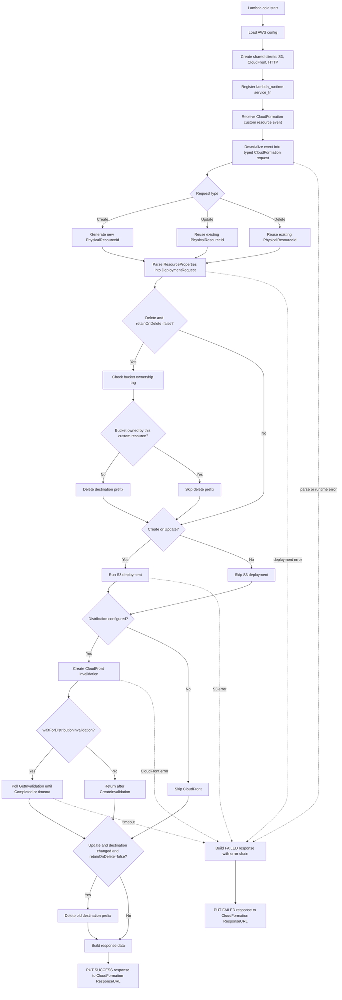
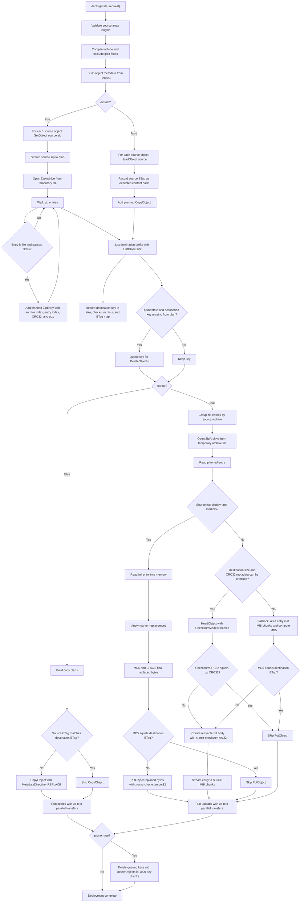
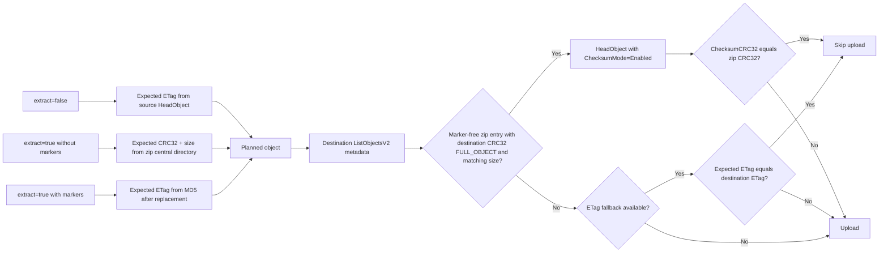
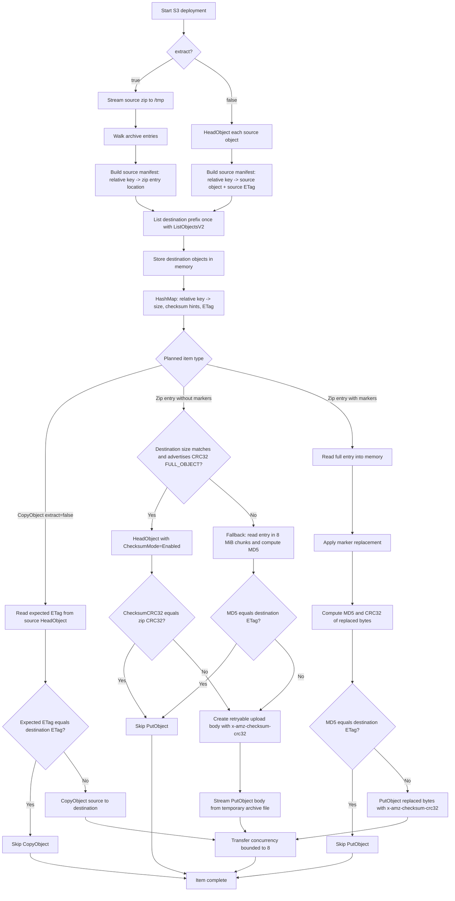

# Lambda Workflow

This document shows the current runtime workflow for the `RustBucketDeployment` provider Lambda.

## GitHub Theme Support

The diagrams below use GitHub-flavored Markdown Mermaid code blocks instead of static images, so GitHub renders them in the viewer's current light or dark theme. If these diagrams are ever exported to image files, use GitHub's theme-aware `<picture>` pattern:

```html
<picture>
  <source media="(prefers-color-scheme: dark)" srcset="diagram-dark.png">
  <source media="(prefers-color-scheme: light)" srcset="diagram-light.png">
  
</picture>
```

## Handler Overview



## S3 Deployment Workflow



## Skip Decision Path



## File Upload Handling

The destination objects are listed once per deployment after the source plan is built. Key, size, checksum algorithm/type, and `ETag` metadata are stored in memory as a key-to-metadata map, not as upload payloads.



For plain zip entries, the handler prefers zip CRC32 plus uncompressed size against S3 full-object CRC32 metadata. When that is available, unchanged entries are skipped without decompressing the entry. If checksum metadata is unavailable, it falls back to reading chunks to compute MD5, compares against the destination ETag map, and only if changed creates a streaming `PutObject` body that emits 8 MiB chunks. With 8 active upload streams, the queued chunk payloads are bounded by the transfer concurrency.

## Current Runtime Notes

- Source zip archives are streamed to temporary files in Lambda `/tmp` and then opened as `ZipArchive` readers.
- Plain zip entries use zip CRC32 and S3 checksum metadata when available. If changed, the upload stream reopens the entry from the temporary archive file and sends one 8 MiB chunk at a time with `x-amz-checksum-crc32`.
- The upload stream is retryable because the body can be rebuilt from the retained temporary source archive.
- Zip entries with deploy-time replacements are still fully materialized in memory after replacement, because the final bytes must be known before computing the ETag/CRC32 and uploading.
- The handler does not extract the archive to disk and does not stage individual zip entries in `/tmp`.
- Copy and upload transfers are bounded by `MAX_PARALLEL_TRANSFERS = 8`.
- `prune=true` lists the destination prefix and deletes destination objects that are not in the planned source set.
- CloudFront invalidation is created after S3 deployment or delete handling; if waiting is enabled, the handler polls until completion or timeout.
