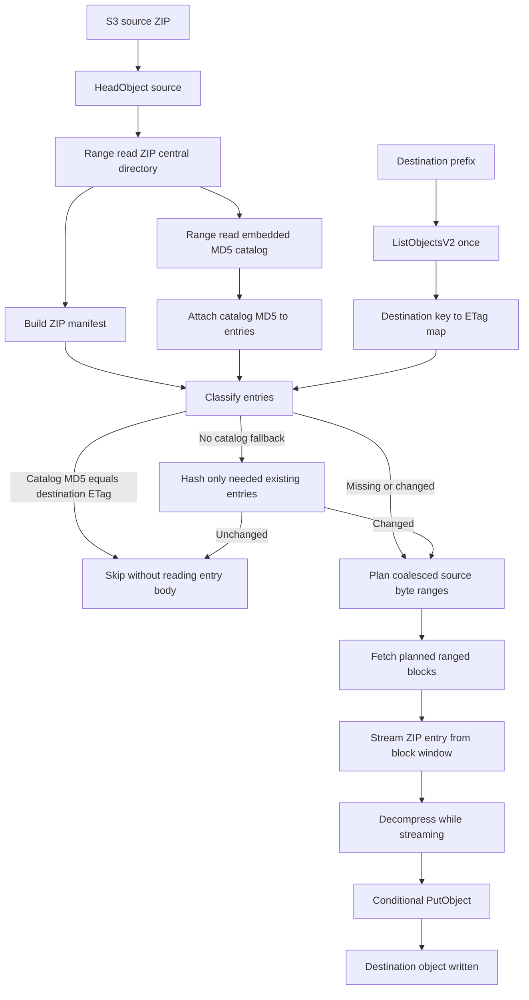
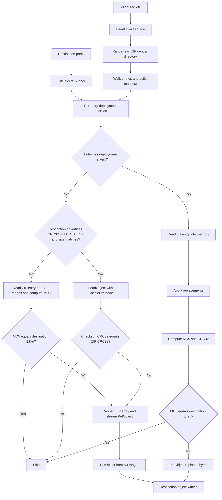
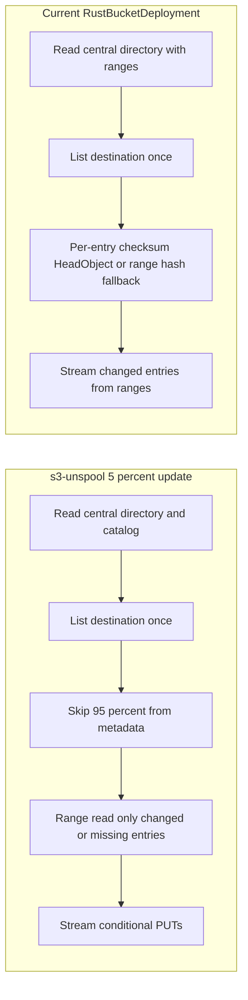

# s3-unspool Comparison

This note compares the current `RustBucketDeployment` provider strategy with
[`s3-unspool`](../../s3-unspool), focusing on why `s3-unspool` performs better
for large S3 ZIP deployments and sparse updates.

## Summary

`s3-unspool` treats the ZIP object in S3 as a random-access source. It reads ZIP
metadata and selected entry bytes with ranged `GetObject` requests, lists the
destination prefix once, and skips unchanged files from an embedded MD5 catalog
when available.

The current provider now uses ranged S3 reads for ZIP metadata and entry bodies.
It preserves CDK deployment behavior while removing the older `/tmp` and
full-archive memory paths. It still lacks `s3-unspool`'s embedded cataloged asset
pipeline and shared coalesced block scheduler.

## Strategy Differences

| Area | `s3-unspool` | Current provider |
| --- | --- | --- |
| Source ZIP access | Ranged `GetObject`; ZIP is never fully downloaded | Ranged `GetObject`; ZIP is never fully downloaded |
| Planning | Reads ZIP central directory from S3 ranges | Reads ZIP central directory from S3 ranges |
| Unchanged skip | Embedded catalog MD5 plus destination ETag from one list | CRC32 path may need checksum-mode `HeadObject`; fallback hashes local entry |
| Upload path | Coalesced range blocks feed decompression and `PutObject` directly | Per-entry S3 ranges feed decompression and `PutObject` directly |
| Concurrency | Separate source range GETs, entry workers, and PUT concurrency | Fixed transfer pool of 8 |
| Large archive behavior | Bounded memory; no ephemeral storage dependency | Bounded memory; no ephemeral storage dependency |
| Write safety | Conditional `PutObject` with `If-None-Match` or `If-Match` | Extracted uploads now use conditional `PutObject`; `extract=false` copy mode remains on `CopyObject` |

## s3-unspool Strategy

## Current Provider Strategy

## Incremental Update Difference

## Why s3-unspool Is Faster

- It can skip unchanged cataloged entries before decompression.
- It avoids per-object checksum `HeadObject` calls when catalog MD5 is available.
- It coalesces nearby ZIP byte spans into bounded ranged reads.
- It pipelines source range reads, decompression, and destination writes.
- It can tune source GET concurrency, entry worker concurrency, and PUT concurrency independently.
- It only reads source bytes for changed or missing entries during cataloged sparse updates.

## Practical Implication

The current provider is optimized for compatibility with CDK `BucketDeployment`
features such as deploy-time marker replacement and metadata handling. The
biggest remaining performance opportunity is cataloged source asset production:
carry a stable content catalog in the source archive so unchanged files can be
skipped from destination listing metadata without checksum `HeadObject` calls or
range-hash fallback work.
